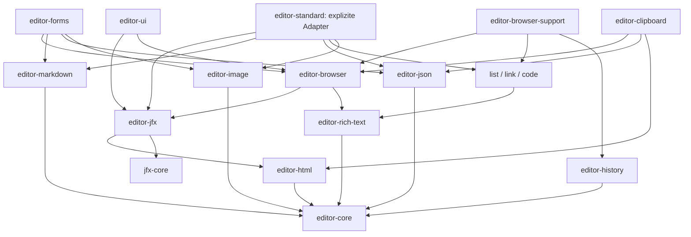

# JFX Editor: Architektur eines nativen Scala.js-Editors

Status: Architekturentwurf, noch keine implementierte Editor-API. Stand: 9. September 2026.

Dieser Entwurf berücksichtigt die Präzisierung des Auftrags: **Der Editor wird vollständig neu entwickelt. Der vorhandene Editor ist ein Prototyp und keine Architektur- oder Implementierungsgrundlage.** Seine öffentliche API dient allenfalls als Inspiration. Die Bestandsanalyse unten betrifft deshalb die gemeinsame JFX3-Infrastruktur. Eine interne Bewertung oder schrittweise Reparatur des Prototyps ist ausdrücklich nicht Teil dieses Vorhabens.

Der zugehörige [Implementierungsplan](JFX_EDITOR_IMPLEMENTATION.md) zerlegt die Entscheidungen in einzeln abnehmbare Arbeitspakete. Alle dort und hier genannten neuen Module, Dateinamen und APIs sind Vorschläge. Vorhandene Fähigkeiten sind als Befund gekennzeichnet; gewünschte Fähigkeiten werden nicht als bereits vorhanden ausgegeben.

## 1. Ziele

Ein eigenständiger Rich-Text-Editor mit kanonischem, unveränderlichem Dokumentzustand, typisierten Änderungen, nachvollziehbarer Selection und unabhängig nutzbaren Funktionen. Der gesamte Editor wird in Scala.js geschrieben. Lexical liefert Konzepte und Vergleichsfälle, keine Laufzeitabhängigkeit und keinen zu portierenden Klassenbauplan.

Die gleichen Dokumente müssen ohne Browser bearbeitet und konvertiert, durch JFX3 semantisch gerendert, serverseitig ausgeliefert und im Browser übernommen werden können. JavaScript erweitert ein bereits benutzbares HTML-Formular. Markdown ist ein direktes Austausch- und Bearbeitungsformat; JSON erhält die vollständige Dokumentstruktur. Bilder und andere Medien enthalten dauerhafte Referenzen, niemals eingebettete Dateidaten.

Die öffentliche API trennt Dokument, Editor-Sitzung, View und Form-Control. Ein Headless-Anwender soll keine Toolbar, Forms, Viewport, DOM-Emulation oder globale Registry mitbringen müssen. Eine spätere TypeScript-Fassade verwendet dieselbe Scala.js-Engine und dieselbe JFX3-Runtime.

## 2. Non-Goals

- Keine Kompatibilität mit internen Lexical-Klassen, Keys, JSON oder `$`-Funktionen; keine mechanische Übertragung von TypeScript nach Scala.
- Keine zweite DOM-Reconciliation, kein VDOM, keine eigene Property-Runtime und kein React-artiger Component-Lifecycle im Editor.
- Keine Übernahme der internen Architektur oder garantierte Quellcodekompatibilität des Editor-Prototyps.
- Kein Upload-Backend, Medien-Storage, automatisches Herunterladen externer Bilder oder automatisches Löschen verwaister Dateien.
- Keine sofortige Feature-Parität mit dem Lexical-Playground. Tabellen, Syntax-Highlighting, mehrere unabhängige Carets und Kollaboration folgen nach dem tragfähigen Editor.
- Keine Zusage vollständiger WHATWG-HTML-Parser-Kompatibilität, quelltextidentischer Markdown-Roundtrips oder professioneller IME-Unterstützung ohne reale Gerätetests.
- SSR bedeutet hier zunächst Scala.js auf der vorhandenen JavaScript-Serverplattform. JVM-Cross-Publishing ist mögliches Folgeprojekt, keine implizit vorhandene Fähigkeit.

## 3. Lexical-Analyse

### 3.1 Quellenbasis und tatsächliche Paketstruktur

Untersucht wurde der lokale Checkout `../lexical`, Version `0.50.0` aus `package.json`, Git-Revision `737b3afafe31e6fc762c0491590d6c026d9ca3cf`. Der Checkout war bei der Erfassung unverändert. Die Analyse bezieht sich auf Quelltexte, nicht auf generiertes JavaScript und nicht auf eine angenommene ältere Lexical-Version.

| Quellen im Nachbarprojekt | Relevante Mechanismen |
| --- | --- |
| [LexicalEditorState.ts](../lexical/packages/lexical/src/LexicalEditorState.ts), [LexicalUpdates.ts](../lexical/packages/lexical/src/LexicalUpdates.ts) | `EditorState`, NodeMap, Selection, Pending State, Update-/Commit-Zyklus, Dirty Sets, Transforms |
| [LexicalGenMap.ts](../lexical/packages/lexical/src/LexicalGenMap.ts) | Generationale Copy-on-write-Map für große EditorState-Maps; Sharing und Kompaktierung |
| [LexicalNode.ts](../lexical/packages/lexical/src/LexicalNode.ts), [nodes](../lexical/packages/lexical/src/nodes) | Keys, `getLatest`, `getWritable`, Root/Element/Text/Decorator, Strukturänderungen |
| [LexicalSelection.ts](../lexical/packages/lexical/src/LexicalSelection.ts) | Anchor/Focus, Text-/Elementpunkte, Range- und Node-Selection, Browserprojektion |
| [LexicalEditor.ts](../lexical/packages/lexical/src/LexicalEditor.ts), [LexicalCommands.ts](../lexical/packages/lexical/src/LexicalCommands.ts) | Command-Registrierung, Prioritäten, Listener, Node-Registrierung |
| [LexicalBuilder.ts](../lexical/packages/lexical-extension/src/LexicalBuilder.ts), [ExtensionRep.ts](../lexical/packages/lexical-extension/src/ExtensionRep.ts) | `buildEditorFromExtensions`, Dependencies, Konfiguration, Konflikte, Aufbau/Registrierung/Disposal |
| [lexical-history/src/index.ts](../lexical/packages/lexical-history/src/index.ts) | Current/Undo/Redo-Snapshots, Änderungsklassifikation, Merge/Push/Historic-Tags, Composition |
| [LexicalReconciler.ts](../lexical/packages/lexical/src/LexicalReconciler.ts), [LexicalMutations.ts](../lexical/packages/lexical/src/LexicalMutations.ts) | Key→DOM-Projektion, gezielte Updates, Kontrolle nativer DOM-Änderungen |
| [LexicalEvents.ts](../lexical/packages/lexical/src/LexicalEvents.ts) | Input-, Keyboard-, Composition-, Selection-, Focus- und Clipboard-Ereignisse |
| [lexical-rich-text](../lexical/packages/lexical-rich-text/src), [lexical-list](../lexical/packages/lexical-list/src), [lexical-link](../lexical/packages/lexical-link/src) | Blocktypen, Editing-Semantik, Listeninvarianten, Links und Commands |
| [lexical-markdown](../lexical/packages/lexical-markdown/src) | Import/Export, typisierte Transformer-Kategorien, Shortcuts, Node-Dependencies |
| [lexical-html](../lexical/packages/lexical-html/src) | HTML-Import/Export, neuere DOM-Import-/Render-Extensions, Node-Regeln |
| [lexical-clipboard](../lexical/packages/lexical-clipboard/src) | interne/HTML/Text-Formate, Fragmentübertragung und Paste |
| [lexical-code](../lexical/packages/lexical-code/src), [lexical-table](../lexical/packages/lexical-table/src), [Playground-Nodes](../lexical/packages/lexical-playground/src/nodes) | Code, Tabellen, spezialisierte Selection, beispielhafte Image-/Decorator-Nodes |

Lexicals Kern enthält bereits Editor und Browserintegration; `headless` schaltet Browserfunktionen aus. Feature-Pakete ergänzen Nodes und Editing-Semantik. `react` bindet sie an eine UI-Runtime; Playground-Plugins sind Anwendungsbeispiele. `extension` bietet im untersuchten Stand einen eigenständigen kompositorischen Aufbau. Das Bild „Core plus React-Plugins“ wäre daher unvollständig.

Für JFX3 trennen wir die Browserintegration konsequenter vom Core. Die Aufteilung in Feature-Pakete übernehmen wir; React-Composer, Lexicals DOM-Renderer und seine zusätzlichen Signals übernehmen wir nicht.

### 3.2 Bewertung der Mechanismen

Die Spalte „JFX3 / Scala-Entscheidung“ beantwortet jeweils, ob das Konzept benötigt wird und was JFX3 bereits selbst leisten kann.

| Mechanismus | Warum er in Lexical existiert / welches Problem er löst | JFX3 / Scala-Entscheidung |
| --- | --- | --- |
| EditorState | Ein konsistentes Dokument mit Selection statt des veränderlichen Browser-DOM als Datenbank; Snapshots für Lesen und History. | Übernehmen. Unveränderliche Scala-Werte mit explizitem Snapshot-Zugriff, ohne aktiven globalen Editor. JFX-Properties transportieren später den Snapshot, definieren ihn aber nicht. |
| NodeMap und stabile Keys | Schneller Zugriff und Identität über neue Node-Versionen hinweg. | Übernehmen, aber Dokument-IDs auch über SSR/JSON erhalten. Lexical-Runtime-Keys sind kein persistentes Dokument-ID-Format. |
| `getLatest` / `getWritable` | Äußerlich imperative Node-API bei Copy-on-write im aktuellen Update-Kontext. | Nicht übernehmen. Ein gelesener Scala-Node bleibt genau der gelesene Snapshot; Änderungen sind explizite Tx-Operationen. |
| RootNode | Eindeutige Dokumentgrenze und Regeln für oberste Kinder. | Übernehmen. Genau eine nicht verschiebbare Root; Rendering-Host und Dokument-Root bleiben verschiedene Dinge. |
| ElementNode | Hierarchie, Kindordnung und Strukturänderungen. | Übernehmen. Immutable Child-Vectors; Parent-Index im Document statt veränderlicher Parent-Referenzen in öffentlichen Nodes. |
| TextNode / Format | Textläufe und Editing-Verhalten; Format/Style dürfen DOM-Details überleben. | Übernehmen. Text plus normalisierte typisierte Marks; keine beliebigen CSS-Strings als Dokumentformat. |
| DecoratorNode | Atomare Inhalte bzw. UI, deren Inneres kein normaler Textbereich ist. | Konzept übernehmen. `AtomNode` mit separater JFX-`NodeView`; Medienreferenz gehört zum Modell, Auswahlrahmen und Dialog nicht. |
| Node Replacement | Eingebaute Typen spezialisieren, ohne jede Aufrufstelle anzupassen. | Explizite Schema-/Factory-Ersetzung mit Konfliktprüfung; bestehende Dokumente werden durch eine Migration geändert. Keine heimliche nachträgliche Klassensubstitution. |
| RangeSelection | Caret und Bereich unabhängig von DOM Range speichern; Anchor/Focus-Richtung erhalten. | Zwingend Core. Explizite Punkte, Affinität und Positionsabbildungen. DOM Range nur in `browser`. |
| NodeSelection | Ein oder mehrere atomare/ganze Nodes auswählen. | Zwingend Core, normalisierte ID-Menge. Keine Gleichsetzung mit mehreren Text-Carets oder Tabellenauswahl. |
| Commands / Prioritäten | Mehrere Features können dieselbe Benutzerabsicht behandeln; der erste zuständige Handler stoppt die Verarbeitung. | Typisierte Identitäts-Keys, benannte Prioritäten und `Handled/Pass`; keine String-Commands. DOM-Cancellation ist eine separate Browserentscheidung. |
| Updates / Double Buffering | Zusammengehörige Änderungen sehen einen Pending State und werden gemeinsam normalisiert und veröffentlicht. | Atomare synchrone Tx mit privatem Draft. Ein Commit ist sofort kanonisch; View-Projektion hat einen expliziten Abschluss. Kein Nachbau der Microtask-Semantik als öffentliche API. |
| Dirty Nodes | Nur betroffene Nodes transformieren und projizieren. | Übernehmen als typisiertes ChangeSet samt betroffenen Eltern. Kein Vollbaumvergleich pro Tastendruck. |
| Transforms | Dokumentinvarianten vor dem sichtbaren Commit herstellen, statt Listener-Update-Kaskaden auszulösen. | Deterministische Fixpunkt-Queue, Typregistrierung und Terminierungsbudget. JFX-Property-Observer sind kein Ersatz für Transforms. |
| Listener | UI, Persistenz, History und Integrationen erhalten konsistente Änderungen; Registrierung ist aufräumbar. | Snapshot-/Commit-Subscriptions im Core; JFX-Adapter übersetzt sie in vorhandene Disposables/Properties. |
| Extensions / Plugins | Wiederverwendbare Konfiguration, Dependencies und registriertes Verhalten; UI-Plugins binden Lebenszyklen an React. | Deklarative Extensions mit typisierten Beiträgen und expliziten Dependencies; UI-Plugins separat in JFX-Komponenten. Kein zweites reaktives System. |
| History | Dokument- und Selection-Snapshots, Gruppierung zusammenhängender Eingaben, Undo/Redo-Kommandos. | Eigenes optionales Modul. Explizite Änderungsursachen sind verlässlicher als ausschließlich aus Textdifferenzen erratene Benutzerabsichten. |
| JSON | Nodes ohne DOM speichern, typisieren und wiederherstellen. | Versioniertes, validiertes Format im separaten Modul. Persistentes Dokument und flüchtige Sitzung getrennt serialisieren. |
| HTML | Austausch mit der Außenwelt; Node-Daten auf semantische Tags abbilden. | Import-Regeln übernehmen, DOM-erzeugenden Export nicht. Ausgabe erfolgt über JFX3; serverseitig keine jsdom-Pflicht. |
| Markdown | Transformer für Syntax→Nodes, Nodes→Syntax und Eingabeshortcuts. | Direkter Scala-Parser/Writer mit spezifiziertem Profil; Syntax-Parser und interaktive Shortcuts getrennt. Lexical-Transformer sind keine Zusage vollständiger CommonMark-Konformität. |
| Clipboard | Mehrere Formate und strukturelle Fragmente erhalten mehr als `textContent`. | Eigenes Modul, mit Prioritätsregeln und typisierten Fragmenten; Browser-API separat gekapselt. |
| Reconciler | Lexical muss als eigenständiger Editor Nodes und Browser-DOM zusammenhalten. | Generische DOM-Erzeugung, Besitz, Einfügen, Verschieben und Entfernen gehören JFX3. Nur Modell→View-Zuordnung und Editing-Koordination gehören dem Editor. |
| Mutation Handling | IME, Autokorrektur, Browser-Editing und Fremdmutationen umgehen JavaScript-Kommandos. | Benötigt. Kontrollierter Native-Input-Adapter führt Beobachtungen in Transaktionen zurück; keine zweite kanonische DOM-Wahrheit. |
| Composition / IME | Native Texteingabe darf nicht durch Re-Render oder Selection-Rücksetzen abgebrochen werden. | Benötigt. Composition-Sitzung mit begrenzter Schreibsperre der betroffenen Projektion, native Eingabebeobachtung und getesteten Abschlussregeln. |
| Focus / Keyboard | Editorbefehle, Browsernavigation und Tools dürfen Caret/Fokus nicht versehentlich verlieren. | Browseradapter plus JFX-Lifecycle; keine Autofocus-Wirkung jedes State-Updates. |

### 3.3 Bewusste Abweichungen

Lexical mischt Modell- und DOM-Verhalten in Node-Klassen und arbeitet mit dynamisch gesetztem Update-Kontext. Beides hilft seiner eigenständigen Runtime, ist hier aber ungeeignet: Ein serverseitig genutzter `ImageNode` braucht weder `createDOM` noch einen aktiven Editor. JFX3 besitzt bereits Komponenten und Host-Knoten.

Auch die aktuelle Lexical-HTML-Ausgabe benötigt ein DOM: `$generateHtmlFromNodes` prüft entsprechende Globals, während `$generateNodesFromDOM` ein bereits geparstes DOM entgegennimmt. Dies ist keine passende SSR-Basis für JFX3. Übernommen werden semantische Import-/Exportregeln, nicht die DOM-Erzeugung dieses Pakets.

Die Browserzweige in Lexical sind wertvolle Testfallquellen. Ein User-Agent-Test oder Timeout wird erst übernommen, wenn ein reproduzierbarer Fehler des neuen Editors samt betroffenem Browser und Test vorliegt. Eine solche Ausnahme erhält Zweck, Gültigkeitsbereich und Entfernungskriterium.

### 3.4 Details des untersuchten Standes, die den Entwurf beeinflussen

- `cloneEditorState` verwendet `cloneMap`: kleine Maps werden kopiert, große in eine `GenMap` überführt; weitere Clones teilen Basis/Nursery, spätere Writes kopieren oder kompaktieren. Lexical kopiert damit **nicht pauschal bei jeder Eingabe die gesamte Map**. Die Scala-Persistent-Map ist eine eigene Implementierungswahl, deren Vorteil gemessen werden muss.
- `getLatest` löst einen Node über seine Key im aktiven State neu auf; `getWritable` klont ihn höchstens einmal pro Update und markiert ihn dirty. `EditorState.clone` kann dagegen dieselbe Map teilen. JSON exportiert das Dokument, nicht die Selection. Diese Unterschiede begründen den expliziten Snapshot-Vertrag in Scala.
- Selection-Mapping erfolgt in Lexical konkret in Operationen wie `TextNode.splitText`, `mergeWithSibling` und `$updateElementSelectionOnCreateDeleteNode`. Es gibt dabei besondere Grenzbias-/Composition-Korrekturen. Die allgemeine komponierbare Mapping-Algebra mit Bookmark-Affinität in §11 ist **unser Entwurf**, keine bereits vorhandene Lexical-API. Lexicals RangeSelection enthält außerdem `format/style`; dafür verwendet JFX das Rich-Text-StateField `TypingMarks`.
- Der aktuelle `DecoratorNode` unterstützt auch Slots und editierbare Teilbereiche; `EditorState` exportiert diese separat als `$slots`. Unser `AtomNode` ist bewusst enger. Captions werden als fachliche Container modelliert, nicht implizit als beliebiger UI-Slot eines atomaren Blatts.
- `triggerCommandListeners` läuft zuerst nach Priorität, innerhalb dieser über Editor und Parent-Editoren. Ein höher priorisierter Parent kann vor einem niedrig priorisierten Child handeln. Neuere `COMMAND_PRIORITY_BEFORE_*` registrieren innerhalb der fünf Buckets vorne. JFXs stabile normale Reihenfolge und nur ausdrücklich vereinbarte Parent-Propagation sind bewusste Vereinfachungen.
- `$applyAllTransforms` normalisiert Text, verarbeitet Dirty Leaves vor absichtlich Dirty Elements und behandelt Root zuletzt. Nur zur Traversierung markierte Vorfahren sind keine gleichwertigen Transform-Kandidaten. Deshalb trennt unser ChangeSet tatsächliche Änderungen und betroffene Vorfahren.
- Die aktuelle History verwendet bereits Composition-Start/Ende, Paste/Cut-Grenzen, injizierbaren Zeitgeber und optionales `maxDepth` mit FIFO-Trim. Default Merge-Delay ist in diesem Checkout 300 ms, `maxDepth` standardmäßig unbeschränkt. JFX ergänzt vor allem explizite Operationsmetadaten, Byte-Budget und eigene Restore-Regeln; diese Mechanismen werden nicht als neu gegenüber Lexical ausgegeben.
- `LexicalBuilder` und `ExtensionRep` trennen Dependency-Auflösung, `init/build/register/afterRegistration`, Konflikte und Cleanup mit AbortSignal. Die im JFX-Entwurf geforderte atomare Rücknahme teilweise fehlgeschlagener Installation ist eine eigene Anforderung, keine aus diesen Schleifen abgeleitete Lexical-Garantie.
- Im [aktuellen HTML-API-Einstieg](../lexical/packages/lexical-html/src/index.ts) existieren auch experimentelle `$generateDOMFromNodes`/`$generateDOMFromRoot` und `DOMRenderExtension`. Der neue [DOMImportExtension-Weg](../lexical/packages/lexical-html/src/import/DOMImportExtension.ts) unterstützt Context/Preprocess und ordnet eigene Regeln vor Dependency-Regeln; er verwendet keine numerischen Importprioritäten. Unser typisiertes Importprofil ist davon unabhängig.
- [Markdown](../lexical/packages/lexical-markdown/src/index.ts) bietet bereits Fragmentimport durch `$generateNodesFromMarkdownString` ohne Root-/Selection-Änderung und Selection-Export durch `$convertSelectionToMarkdownString`. [ClipboardImportExtension](../lexical/packages/lexical-clipboard/src/ClipboardImportExtension.ts) bietet MIME-Middleware mit intern/HTML/plain text/URI list und prüft für internes JSON den Namespace. JFX übernimmt die Idee validierter Fragmente und MIME-Fallbacks mit eigenem Schema-/Profilvertrag.

## 4. JFX3-Bestandsanalyse: gemeinsame Infrastruktur

Untersuchte Basis: Repository-HEAD `fd3e4af0c14c6b8062b0ce8333730f881bb9642a` und die zu Beginn vorhandenen lokalen Dateien. Im Workspace lagen bereits fremde Änderungen, insbesondere im Tabellenbereich; dieser Dokumentationsauftrag ändert sie nicht.

| Vorhandene Quelle | Befund | Konsequenz für den neuen Editor |
| --- | --- | --- |
| [Runtime.scala](jfx-core/src/main/scala-3/jfx/core/component/Runtime.scala), [AbstractComponent.scala](jfx-core/src/main/scala-3/jfx/core/component/AbstractComponent.scala) | Mount/Unmount besitzt Parent/Children, physische Hosts und Disposal; Mountfehler lösen Cleanup aus. | Einziger Besitzer der View-Komponenten. Editor-Code darf keine parallele Component-Children-Verwaltung führen. |
| [Cursor.scala](jfx-core/src/main/scala-3/jfx/core/render/Cursor.scala), [HostElement.scala](jfx-core/src/main/scala-3/jfx/core/render/HostElement.scala) | Gemeinsame DOM-/SSR-/Hydration-Schnittstellen, virtuelle Ranges. | Dieselben NodeViews für SSR und Browser verwenden. |
| [Property.scala](jfx-core/src/main/scala-3/jfx/core/state/Property.scala), [ListProperty.scala](jfx-core/src/main/scala-3/jfx/core/state/ListProperty.scala) | Synchrone Beobachter; Listenänderungen sind differenziert, aber nicht transaktional gebündelt. | Commit erst im Editor berechnen, danach projizieren. Eine Property ist weder Transaktion noch History. |
| [Foreach.scala](jfx-core/src/main/scala-3/jfx/core/statement/Foreach.scala), [PropertyForeach.scala](jfx-core/src/main/scala-3/jfx/core/statement/PropertyForeach.scala) | Kein Key-Parameter/Move-Vertrag. Reset ersetzt alle Items, UpdateAt standardmäßig ein Item; indexed Änderungen bauen einen Suffix neu. | `Property[Document] → foreach(children)` wäre für Editing ungeeignet. Generische keyed Children mit stabilen Instanzen ergänzen. |
| [DomTextNode.scala](jfx-core/src/main/scala-3/jfx/core/render/DomTextNode.scala), [TextComponent.scala](jfx-core/src/main/scala-3/jfx/core/layout/TextComponent.scala) | Der Textknoten bleibt erhalten, aber `node.data` wird vollständig geschrieben; auch Host-Bindung setzt Text. | Identische Werte nicht erneut schreiben; gezielte UTF-16-Text-Splices ergänzen. Hydration muss Nutzereingaben vor dem Binden erfassen. |
| [HydratingCursor.scala](jfx-core/src/main/scala-3/jfx/core/render/HydratingCursor.scala) | Strict prüft Tag/Nodetyp/Anker/Restknoten; `claimText(initial)` prüft nicht den Textinhalt. `afterHydration` folgt auf vollständige Claim-Prüfung. | Kein vorhandener Editor-State-Abgleich und keine zugesicherte lokale Reparatur. Aktivierung erst nach erfolgreichem Claim. |
| [DomHostElement.scala](jfx-core/src/main/scala-3/jfx/core/render/DomHostElement.scala), [SsrNode.scala](jfx-core/src/main/scala-3/jfx/core/render/SsrNode.scala) | DOM `insertBefore` kann vorhandene Nodes bewegen; SSR-Insertion allein entfernt die alte Referenz nicht. | Move benötigt ausdrücklich gleiche DOM-/SSR-Semantik und Runtime-Ownership, nicht nur einen DOM-Aufruf. |
| [UiEvent.scala](jfx-core/src/main/scala-3/jfx/core/render/UiEvent.scala), [DomUiEvent.scala](jfx-core/src/main/scala-3/jfx/core/render/DomUiEvent.scala), [DomNodes.scala](jfx-core/src/main/scala-3/jfx/core/render/DomNodes.scala) | Beliebige Eventnamen, raw Event und aufräumbare Handler; interner Zugriff auf reale DOM-Nodes. | Browser-spezifische Eingabetypen im Editoradapter; keine neue globale DOM-Abstraktion erforderlich. |
| [Control.scala](jfx-forms/src/main/scala-3/jfx/forms/Control.scala) | Form-Control-Vertrag mit Wert, Editable, Fokus, Fehlern und Validierung. | Separater Forms-Adapter; der Core wird kein `Control[String]`. |
| [SsrTextNode.scala](jfx-core/src/main/scala-3/jfx/core/render/SsrTextNode.scala), [Input.scala](jfx-forms/src/main/scala-3/jfx/forms/Input.scala) | Leerer allgemeiner SSR-Text wird als Kommentaranker ausgegeben; Input implementiert ein input, keinen Textarea-Vertrag. | Generische Textarea-Unterstützung ergänzen: RCDATA, führende LF, defaultValue/value und Hydration müssen gesondert behandelt werden. |
| [build.sbt](build.sbt), [BridgeRuntime.scala](jfx-bridge/src/main/scala-3/jfx/bridge/BridgeRuntime.scala) | Derzeit ein Editor-Artefakt auf Forms mit Lexical-Dependency; gemeinsame Scala.js-Bridge. | Neue Module unabhängig anlegen; später Integration bewusst umstellen. Diese Build-Fakten begründen keine Übernahme des Prototyps. |

Öffentliche API-Inspiration aus den Editor-READMEs und der TypeScript-Signatur: benanntes Formularfeld, initialer Wert, editierbar/readonly, Platzhalter und Media-Service. Das neue Modell übernimmt weder „Markdown ist der einzige Editorzustand“ noch eine feste Liste stringbasierter Plugin-Namen oder obligatorische Toolbars/Dialogs.

## 5. Architektur und Zuständigkeiten

```text
Anwendung / optionale Forms- und UI-Adapter / spätere TS-Fassade
                 |
          EditorSession + Extensions
                 |
    Document + Selection + Transaction + Commands
       |                 |                 |
    History          JSON/Markdown     HTML-Import
       |
       +---------- Commit / ChangeSet ----------+
                                                v
                                  JFX DocumentView / Projection
                                                |
                                 JFX Runtime + Cursor + Hosts
                                     SSR / DOM / Hydration
                                                ^
                                  BrowserInput / SelectionPort
                                  Beobachtungen -> Transaktionen
```

Vier Zustandsarten dürfen nicht ineinanderlaufen:

1. **Document:** persistierbare fachliche Struktur mit IDs und Schema, keine DOM-Referenzen.
2. **EditorState:** Document plus logische Selection und transaktionale StateFields der Sitzung.
3. **ViewState:** NodeId→JFX-Komponenten, DOM-Punktabbildung, gerenderte Revision. Vollständig aus Modell und Mount-Konfiguration rekonstruierbar.
4. **External effects:** Uploads, Netzwerk, Fokus, Clipboard und native Composition-Sitzung. Aufräumbar; Ergebnisse werden mit expliziter Revision/Bookmark wieder in Transaktionen eingespeist.

Der Core veröffentlicht genau einen unveränderlichen Commit. Die View verarbeitet dessen ChangeSet synchron in JFX-Komponenten und meldet danach die gerenderte Revision. Die Browser-Selection wird erst gegen diese Revision geschrieben. Öffentliche Commit-Listener dürfen den neuen State lesen, aber daraus nicht ableiten, dass eine beliebige View schon fertig ist; dafür existiert ein eigener `afterProjection`-Vertrag. Ein Fehler nach dem Commit rollt das gültige Dokument nicht heimlich zurück: die View geht in Recovery und zeigt den gültigen Zustand oder den gesicherten Fallback.

## 6. Modulstruktur

Verzeichnisse heißen `jfx-editor-*`, sbt-IDs und Artefakte konsistent `scalajs-jfx-editor-*`. Basispaket: `jfx.editor`. Neue Kernklassen werden nicht in den alten `Editor` hineingeschrieben.

| Modul | Verantwortung | Direkte Produktionsabhängigkeiten |
| --- | --- | --- |
| `jfx-editor-core` | Document, IDs, Schema, offene Mark-/MarkSet- und TextBoundary-Service-Verträge, Selection/Mapping, primitive Operationen, Tx, Session, Commands, Extension-/StateField-Verträge | Scala-/Scala.js-Standardbibliothek |
| `jfx-editor-rich-text` | Paragraph, Heading, Quote, Breaks, Marks, Bereichsformatierung und strukturelle Textbearbeitung | core |
| `jfx-editor-history` | Undo/Redo, Gruppierung, Limits, History-Commands | core |
| `jfx-editor-list` | List/ListItem, Ein-/Ausrücken, Listennormalisierung | core, rich-text |
| `jfx-editor-link` | LinkNode, Link-Commands und Link-URL-Policy | core, rich-text |
| `jfx-editor-image` | Image/Media-Referenzen, Atom-Semantik, validierte Quellen und Maße | core |
| `jfx-editor-code` | CodeBlock, Sprache als Metadatum, Code-Editing | core, rich-text |
| `jfx-editor-json` | Wire-ADT, Node-Codecs, Schema-/Dokumentversionen, Validierung | core |
| `jfx-editor-markdown` | Scala-Syntaxparser, Writer, SourceMap und typisierte AST-Adapter-SPI | core |
| `jfx-editor-html` | Sichere HTML-Fragmentrepräsentation, Importparser, typisierte Import-/Semantikregeln | core |
| `jfx-editor-jfx` | DocumentView, NodeView-SPI, Commit-Projektion, JFX-Property-Adapter, HTML-Ausgabe über JFX | core, html, jfx-core |
| `jfx-editor-standard` | Separat wählbare Standard-Adapter für JSON, Markdown, HTML und NodeViews; komfortable Presets | rich-text, list, link, image, code, json, markdown, html, jfx |
| `jfx-editor-browser` | Input, SelectionPort, Composition, Mutationen, Fokus und Hydration-Aktivierung | core, rich-text, jfx |
| `jfx-editor-browser-support` | Optionale konkrete Key-/Input-Bindings für History, Listen, Links und Code; getrennt vom Browsermechanismus | browser, history, list, link, code |
| `jfx-editor-clipboard` | Copy/Cut/Paste, Dokumentfragmente, Clipboard-Port | core, rich-text, json, html, browser |
| `jfx-editor-forms` | Markdown-/JSON-Feld, Textarea-Fallback, Submit/Reset, Media-Service-Port und Multipart-Vertrag | core, jfx, browser, markdown, json, image, jfx-forms |
| `jfx-editor-ui` | Optionale Toolbars, Link-/Image-Dialoge, Commands/Status anzeigen | core, rich-text, history, link, image, jfx, browser, jfx-controls, jfx-viewport |
| `jfx-editor-table` (später) | Table/Row/Cell, Zellbereichsselection, Editing und eigene Adapter | core, rich-text; Adapter gezielt zusätzlich json/html/jfx |

`standard` ist bewusst ein optionales Integrationsmodul: Dadurch kennen die Node-Module weder Markdown noch JFX und die Format-SPIs keine konkreten Feature-Nodes. Seine einzelnen Adapter sind eigene Fabriken/Objekte ohne eager globale Sammelregistrierung. Eine reine Paragraph-Anwendung wählt nur Paragraph-/Text-Support. Eine Fremderweiterung liefert ihre Adapter in ihrem eigenen Modul und ändert `standard` nicht.

Der Browsermechanismus nimmt typisierte Input-/Key-Bindings und Effect-Callbacks entgegen. Konkrete History-/List-/Code-Commands werden durch `browser-support` oder die Anwendung verdrahtet; `browser` importiert diese Feature-Pakete nicht. Picker und Uploadkoordination liegen im Forms-Adapter, der Browser-/Clipboard-File-Intents konsumiert. So entsteht keine Rückkante `browser → forms`. Konkrete Link-/Image-Dialoge dürfen ihre Feature-Typen im optionalen UI-Modul direkt verwenden.

Die Trade-offs sind ausdrücklich: Das Integrationsmodul hat viele Compile-Abhängigkeiten; die tatsächlich gelinkte Größe muss gemessen werden. Falls einzelne Fabriken trotz getrennter Erreichbarkeit unerwünschte Features festhalten, werden betroffene Adapter in kleinere Integrationsartefakte ausgelagert. Das ist ein messbares Akzeptanzkriterium, kein blindes Vertrauen in Tree Shaking.

Kein separates optionales `selection`: Tx und History benötigen die Typen und Maps zwingend. Kein separates `reactive`: der kleine Adapter gehört zu `jfx`. Syntax-Highlighting, Collaboration, Mentions und Autocomplete werden erst bei Implementierung eigenständige Feature-Module; jetzt werden keine leeren Projekte dafür erzeugt.

## 7. Dependency Graph

Pfeile bedeuten „hängt ab von“. Die Tabelle in §6 ist der vollständige direkte Graph; folgende Sicht zeigt die Schichten.



UI-/Form-Abhängigkeiten reichen niemals nach unten zurück. `core` hat kein `org.scalajs.dom`, keine JFX-Property, kein Forms-/Viewport-Import. Die allgemeinen Build-Settings dürfen dort daher nicht unverändert `scalajs-dom` hinzufügen. Produktions- und Testabhängigkeiten werden getrennt geprüft. Jedes veröffentlichte Modul darf nur auf veröffentlichte Artefakte verweisen.

## 8. Node Model

### 8.1 Offene fachliche Typen, geschlossene Strukturregeln

Ein über alle Features `sealed trait EditorNode` verhindert Erweiterungen in fremden Scala-Dateien/Modulen. Deshalb ist der Node-Vertrag offen; strukturelle Kategorien, Operationen und Validierungsergebnisse sind geschlossene ADTs. Built-ins sind immutable Case Classes. Schema-Deskriptoren definieren typisierte Projektion und gültige Kindformen.

API-Skizze, keine bereits kompilierte Implementierung:

```scala
opaque type NodeId = String

trait EditorNode:
  def id: NodeId

trait ElementNode extends EditorNode:
  def children: Vector[NodeId]

trait AtomNode extends EditorNode

final case class RootNode(id: NodeId, children: Vector[NodeId]) extends ElementNode
final case class TextNode(id: NodeId, text: String, marks: MarkSet) extends EditorNode

// In rich-text, nicht im Core:
final case class ParagraphNode(id: NodeId, children: Vector[NodeId]) extends ElementNode
final case class HeadingNode(id: NodeId, level: HeadingLevel,
                             children: Vector[NodeId]) extends ElementNode

trait NodeType[N <: EditorNode]:
  def typeId: NodeTypeId
  def project(node: EditorNode): Option[N]
  def rekey(node: N, id: NodeId): N
  def validate(node: N, document: DocumentRead): Vector[Violation]

trait ElementNodeType[N <: ElementNode] extends NodeType[N]:
  def withChildren(node: N, children: Vector[NodeId]): N
```

`NodeType[N]` bindet Registry, Transform, Codec und View an denselben Scala-Typ. Heterogene Registries werden intern durch existenzielle Einträge gekapselt; keine öffentliche `Map[String, Any]`. Ein Deskriptor prüft seinen Typzeugen, bevor ein typisierter Handler läuft. IDs für Wire-Formate sind versionierte Namen; Commands verwenden davon unabhängig Objektidentität.

`rekey` und `withChildren` sind unveränderliche Rekonstruktionsverträge: Sie erhalten alle anderen fachlichen Felder und ermöglichen generische Insert/Move-/Paste-Operationen auch für fremde Case Classes. Der Core kann und darf deren `copy`-Signatur nicht erraten. Vertragsprüfungen testen ID-/Children-Ergebnis und erhaltene Zusatzdaten; fehlender Element-Deskriptor verhindert eine Schema-Registrierung als Container.

### 8.2 Speicherung und Invarianten

`Document` kapselt eine persistente `Map[NodeId, EditorNode]`, eine Root-ID und einen abgeleiteten persistenten Parent-Index. Ein Parent-Link enthält die Parent-ID; Positionsindizes in großen Child-Vectors sind optionaler Cache und keine zweite persistente Wahrheit. Kinder sind ausschließlich referenzierte IDs. Mutationen dürfen nicht separate rekursive Kopien des gesamten AST erzeugen.

Ein Commit garantiert: genau eine Root, eindeutige IDs, erreichbare Nodes, keine Zyklen, jeder andere Node genau ein Parent, gültige Kindreihenfolge und schemakonforme Inhalte. Root darf nicht Kind sein. Entfernte Teilbäume verschwinden aus dem neuen Index und bleiben nur in noch referenzierten Snapshots erhalten. Vollvalidierung erfolgt beim Import; lokale Änderungen validieren betroffene Nodes und Strukturpfade. Entwicklungs-/Property-Tests vergleichen dies mit einer unabhängigen Vollvalidierung.

Core erlaubt eine leere Root. Das Rich-Text-Profil stellt für eine editierbare leere Fläche einen Paragraph und eine gültige Caretposition her. Inline-/Blockregeln sind Schemaeigenschaften: ein Paragraph enthält Inline-Inhalte, eine Liste ListItems, ein ListItem Blockinhalte. Ein Link enthält keine anderen Links. CodeBlock erlaubt Text mit Zeilenumbrüchen, aber keine beliebigen Rich-Text-Kinder.

Text-Marks sind typisierte, normalisierte Werte; Built-ins: Strong, Emphasis, Underline, Strike, InlineCode. Widersprüche und gegenseitiger Ausschluss werden vom Profil bestimmt. Links sind Inline-Container, keine Text-Mark. SoftBreak und HardBreak bleiben unterscheidbar, damit Markdown und semantisches HTML ihre Bedeutung erhalten.

### 8.3 IDs, Ersetzung und Effizienz

IDs gelten innerhalb eines Dokuments; die Browserzuordnung verwendet zusätzlich eine Editor-Instance-ID. Server- und Client-Snapshot erhalten dieselben IDs. Ein injizierter Generator reserviert vorhandene IDs und liefert neue ohne globale Zähler; Testgeneratoren sind deterministisch. Paste aus fremden Dokumenten remappt IDs vollständig. Reorder erhält IDs, Split behält die linke Text-ID und erzeugt rechts eine neue, Merge behält links und liefert Mapping für rechts.

Factory-Replacement wird beim Schemaaufbau validiert und betrifft künftige Erzeugung. Bestehende Nodes werden nur durch explizite, atomare Migrations-/Replace-Operationen geändert. Dabei werden Selection, Bookmarks, Codec-Version und eventuell History behandelt; ein Rendererwechsel allein migriert kein Dokument.

Persistente Maps/Vectors sind die erste Implementierung. Ein Text-Edit kopiert den betroffenen String und wenige Indexpfade, nicht alle Nodes. Strukturänderungen können Kosten proportional zur betroffenen Geschwisterliste haben; Parent-Suche mit linearem Child-Scan ist keine O(1)-Behauptung. Rope/Piece-Table, Order-Index oder segmentierte Texte werden erst anhand gemessener Lasten eingeführt. Traversierung ist iterativ bzw. tiefenbegrenzt, damit importierte tiefe Bäume keinen Stacküberlauf auslösen.

## 9. EditorState

```scala
final case class EditorState(
  document: Document,
  selection: Option[Selection],
  revision: Revision,
  fields: StateFields
)

final case class Commit(
  previous: EditorState,
  current: EditorState,
  changes: ChangeSet,
  mapping: PositionMapping,
  meta: TransactionMeta
)
```

`StateFields` ist ein gekapselter heterogener Speicher mit `StateField[A]`-Schlüsseln und reinem Reducer. Er ist keine frei beschreibbare Map. Felder deklarieren explizit, ob sie auf Dokumentwechsel zurückgesetzt oder gemappt werden; Persistenz ist optional und benötigt einen Codec. Upload-Jobs, DOM-Knoten und Handler sind keine StateFields.

Snapshots sind außerhalb jeder Update-Closure lesbar. Ein altes Node-Objekt liest niemals automatisch neue Daten. Revisionen steigen auch bei Undo; der wiederhergestellte Dokumentinhalt erhält eine neue Sitzungsrevision. Dokumentrevision und Sitzungsrevision werden bei Bedarf getrennt, damit reine Selection-Änderungen keine Persistenz auslösen.

SSR rendert ein Document ohne lokale Selection, History oder Fokus. Ein separat vereinbartes Session-Exportformat kann Selection für Wiederaufnahme transportieren; normales Dokument-JSON tut dies nicht. Der Browser erzeugt seine Selection aus tatsächlicher Benutzerinteraktion.

## 10. Transactions, Updates, Transforms und Listener

```scala
val result: Either[UpdateError, Commit] = editor.update { tx =>
  richText.insertText(tx, "Hello")
}
```

Die Session besitzt den aktuellen State. Eine Tx erhält einen privaten Draft und primitives `insert/remove/move/replace/spliceText/setSelection`; fachliche Module implementieren darauf z.B. `insertParagraph` oder `toggleMark`. Ein Tx-Handle wird nach Abschluss ungültig und darf nicht in Futures gespeichert werden.

Commit-Reihenfolge:

1. Ausgangsrevision, Berechtigungen und Metadaten erfassen; Operationen im Draft sammeln.
2. Jede Operation aktualisiert Document, Parent-Index, Dirty Set und Positionsabbildung gemeinsam. Spätere Operationen beziehen sich auf den jeweils aktuellen Draft.
3. Bestehende Selection und registrierte Bookmarks entlang der Operationen mappen; explizite neue Selection wird gegen den zugehörigen Draft validiert und danach weitergemappt.
4. Typisierte Transforms auf Dirty Nodes in deterministischer Reihenfolge bis zum Fixpunkt ausführen; neue Operationen gehen durch dieselbe Pipeline.
5. Lokale Invarianten, synchrone PreCommit-Regeln und StateField-Reducer prüfen. Auch ein Reducer kann mit typisiertem Fehler ablehnen. Ein Transform-Zyklus, verletzte Invariante oder nicht darstellbarer Formwert verwirft die gesamte Tx.
6. Unveränderlichen State atomar veröffentlichen. No-op erzeugt keinen Dokumentcommit und keine History-Stufe.
7. Commit-Konsumenten benachrichtigen; die JFX-Projektion meldet separat ihren Abschluss. Ein fehlerhafter Listener wird an den Error-Sink gemeldet und verhindert nicht die übrigen Benachrichtigungen.

Tx-Closures sind synchron und liefern `Unit`; asynchrone Arbeit findet außerhalb statt. Öffentliche verschachtelte `editor.update`-Aufrufe sind ein Fehler. Innerhalb einer Tx werden Commands über `tx.dispatch` im selben Draft ausgeführt. Listener dürfen Änderungen nur durch `editor.enqueueUpdate` für einen folgenden Commit anfordern. Das verhindert versteckte Reentranz, ohne Aktualisierungsbedarf zu verlieren.

`ChangeSet` unterscheidet created/updated/removed/moved, Text-Splices, geänderte Childlisten und reine Selection-/Field-Änderungen. Ein Dirty-Ancestor bedeutet nicht, dass dessen gesamter Teilbaum neu gerendert werden muss. Der Commit darf nicht sämtliche bisherigen Operationen dauerhaft festhalten: Mapping- und History-Retention sind begrenzt und haben eigene Besitzer.

Transforms sind idempotent zu entwerfen, lesen ausschließlich den Draft und haben keine DOM-/Netzwerknebenwirkungen. Reihenfolge: deklarierte Phase, Abhängigkeitsordnung, Registrierungsordnung. Ein konfiguriertes Arbeitsbudget mit Diagnose der beteiligten Typen verhindert Endlosschleifen; das Budget ist kein stilles Abschneiden der Normalisierung.

## 11. Selection und Positionsabbildung

```scala
enum Affinity:
  case Before, After

enum Point:
  case Text(node: NodeId, utf16Offset: Int, affinity: Affinity)
  case Children(parent: NodeId, childOffset: Int, affinity: Affinity)

trait Selection
final case class RangeSelection(anchor: Point, focus: Point) extends Selection
final case class NodeSelection(nodes: Set[NodeId]) extends Selection
```

Selection ist als Erweiterungsvertrag offen, damit Tabellen später einen eigenen Zellbereich anbieten können. Jede Selection-Art benötigt einen registrierten Mapper/Validator; Range und Node sind eingebaut. Ein Caret ist eine kollabierte Range. Anchor/Focus werden niemals nur zugunsten sortierter Endpunkte überschrieben. Vorwärts/rückwärts ergibt sich aus der aktuellen Dokumentordnung, nicht aus lexikographischer ID-Sortierung.

UTF-16 ist das explizite Offsetmaß zwischen Scala.js-Strings und DOM-Text. Benutzeraktionen wie Backspace und Pfeilnavigation operieren auf Graphem-/Wortgrenzen; sie dürfen weder Surrogatpaare noch kombinierte Zeichen zerlegen. Der Core bekommt einen injizierbaren `TextBoundaryService`; eine native Scala-Implementierung mit festgelegten Unicode-Daten ist die deterministische Basis. Browser-Segmentierung kann später ein getesteter Adapter sein. UTF-16-Offsets allein beweisen keine korrekte Unicode-Bearbeitung.

`TypingMarks` ist ein transaktionales StateField des Rich-Text-Moduls, mit `Inherit` oder explizitem `MarkSet` an einer gemappten Caretposition. Ein Toggle am kollabierten Caret ändert dieses Feld, ohne Text zu erzeugen. Die nächste Eingabe verwendet diese Marks. Ein expliziter Caretsprung oder Range-Wechsel setzt wieder auf kontextabhängiges Inherit; bloßes Mapping desselben Carets durch eigene Eingabe erhält die explizite Wahl. Range-Formatierung ändert dagegen die betroffenen Textnodes. Die History speichert dieses deklarierte Restore-Feld mit ihrer Selection; Undo/Redo darf die für die nächste Eingabe wirksamen Marks nicht zufällig aus der DOM-Darstellung ableiten.

| Operation | Mapping-Regel |
| --- | --- |
| InsertText an Offset p | Punkte davor bleiben; Punkte danach wandern um die UTF-16-Länge; genau p entscheidet die Affinität. |
| DeleteText [a,b) | Punkte im gelöschten Bereich fallen auf a; Punkte dahinter verlieren b-a. Anchor und Focus werden unabhängig gemappt. |
| SplitText bei p | Linke ID bleibt. Rechts liegende Punkte wechseln zur neuen rechten ID mit Offset minus p; Gleichheit entscheidet Affinität. |
| MergeText links/rechts | Rechte Punkte wechseln zur linken ID plus ursprünglicher linker Länge. |
| Insert/Remove Child | Parent-Offsets werden entsprechend verschoben; exakte Grenze verwendet Affinität. |
| Move Subtree | Punkte in überlebenden Nodes behalten ID und Offset; alte und neue Parent-Offsets werden komponiert gemappt. |
| Remove Subtree | Punkte innerhalb fallen auf die erhaltene Einfügegrenze im Parent zurück; wird dieser ebenfalls entfernt, weiter nach außen. Rich-Text-Normalisierung löst die Grenze in eine gültige editierbare Position auf. |
| Replace | Expliziter Mapper für erhaltene Bedeutung; andernfalls definierter Rückfall auf die Replace-Grenze. Keine heuristische Zuordnung nach Textgleichheit. |

Mappings sind komponierbar und für Bookmarks nutzbar. Ein Bookmark trägt die Ausgangsrevision; wenn benötigte Maps nicht mehr verfügbar sind, entsteht ein expliziter `ExpiredBookmark` statt einer falschen Einfügung. Uploads nutzen registrierte Live-Bookmarks oder brechen ab. `NodeSelection` entfernt gelöschte IDs, bewahrt verschobene und normalisiert ausgewählte Nachfahren bereits ausgewählter Vorfahren.

DOM-Seite: `SelectionPort` liest nur Selection innerhalb seines Editing-Hosts, berücksichtigt ownerDocument/Window und bildet Text-Wrapper, markierte Teilstrukturen, leere Paragraphen und atomare Nodes auf Modellpunkte ab. Bei DOM-Elementoffsets zählen DOM-Kinder einschließlich Renderhilfen anders als Dokumentkinder; die explizite Mapping-Tabelle löst dies auf. Ein Platzhalter-`br` ist kein persistentes Dokumentzeichen.

Browser-Pfeilnavigation darf zunächst nativ laufen; `selectionchange` importiert das Ergebnis. Bidi-Visualordnung wird nicht aus logischer Dokumentreihenfolge erraten. Node-Navigation und fachliche Grenzen erhalten eigene Commands. Mehrere unabhängige Text-Ranges sind kein MVP; NodeSelection über mehrere Nodes ist bereits möglich.

## 12. Commands

```scala
trait EditorCommand[A] // Instanzidentität, kein lookup anhand eines Strings
case object Undo extends EditorCommand[Unit] // im History-Modul

enum CommandResult:
  case Pass, Handled

enum CommandPriority:
  case Critical, High, Normal, Low, Fallback

editor.register(Undo, CommandPriority.Normal) { (tx, _) =>
  history.undo(tx)
}
```

Payload-Typ wird bei Registrierung und Dispatch geprüft. Handler laufen von Critical bis Fallback, bei gleicher Priorität in stabiler Registrierungsreihenfolge. `Handled` beendet die Command-Kette. `Pass` muss nebenwirkungsfrei sein; im Entwicklungsmodus wird geprüft, dass der Handler den Draft nicht verändert hat. Fehler verwerfen den gesamten Dispatch-Commit. Abmelden ist idempotent und wirkt beim nächsten Dispatch; die laufende Handlerliste ist ein Snapshot.

Commands sind Benutzer-/Anwendungsabsichten; nicht jede primitive Operation wird ein öffentliches Command. `dispatch` außerhalb einer Tx eröffnet genau eine Tx, `tx.dispatch` benutzt die laufende. Keine automatische Propagation in Parent-Editoren: eingebettete Editoren müssen diese explizit vereinbaren, damit Undo nicht ein fremdes Dokument verändert.

`preventDefault` und `stopPropagation` sind Browserereignis-Operationen, nicht Command-Resultate. Der Browseradapter verhindert eine native Aktion genau dann, wenn er sie erfolgreich ersetzt oder bewusst abweist. Ein nicht behandeltes Tastaturereignis bleibt Browsernavigation. `historyUndo/historyRedo` werden mit dem eigenen History-Modul verbunden, nicht mit einer parallelen Browser-History.

Ausnahme von „unbehandelt bleibt nativ“ sind Mutationen des besessenen Editor-Dokuments, die ausdrücklich verboten wurden: Readonly-/Schema-/Limit-Ablehnungen und History-Ereignisse ohne verfügbaren Undo-/Redo-Schritt müssen die native Ersatzänderung verhindern. Das gilt auch bei null oder NodeSelection. Die normale History eines eigenständigen nativen Inputs bleibt hingegen dessen Zuständigkeit; entscheidend ist das tatsächlich betroffene Editing-Target.

## 13. Extensions und optionale UI-Plugins

Die Extension-Konfiguration wird vor Erstellung der Session aufgelöst. Sie enthält typisierte Beiträge für NodeTypes, Commands, Transforms, StateFields und Capabilities. Adapter-Konfigurationen ergänzen unabhängig Codecs, NodeViews und Browserverhalten; der Core bekommt keine Referenz auf diese konkreten UI-/Formattypen.

```scala
val session = EditorSession.create(
  document = document,
  extensions = Vector(RichText(), Lists(), Links(), Images(), History())
)
// Separat: documentView(session, nodeViews); MarkdownCodec(rules); editorField(...)
```

Extension-Fabriken dürfen Konfiguration komponieren, aber beim Erzeugen keinen DOM-Zugriff oder globale Registrierung ausführen. Auflösung prüft Duplicate IDs, widersprüchliche Konfiguration, fehlende Dependencies, Zyklen und mehrfache Node-Replacements vor jeder Installation. Typisierte Konfigurationsbeiträge besitzen eine explizite Combine-Regel; keine allgemeine „letzter Eintrag gewinnt“-Map.

Lifecycle: resolve → validate → install → dispose in umgekehrter Reihenfolge. Teilweise fehlgeschlagene Installation räumt alle bis dahin installierten Ressourcen auf. Das Node-Schema bleibt für eine Session fest. Laufzeitänderungen an aktiv/readonly oder Shortcut-Einstellungen sind erlaubt; ein Schemawechsel benötigt Document-Migration und eine neue bzw. kontrolliert rekonfigurierte Session.

CodeMirror zeigt mit Facets, StateFields und Extension-Bündeln ein brauchbares Modell für das Zusammenführen von Konfiguration und Zustand. Übernommen wird diese Trennung; dynamische Compartments und eine allgemeine Konfigurationssprache sind zunächst unnötig. Auch Lexical hat im untersuchten Stand bereits dependency-basierte Extensions. Diese Entscheidung ist ein eigener Entwurf, keine Behauptung, Lexical verfüge nur über UI-Plugins. Quellen: [CodeMirror-Konfiguration](https://codemirror.com/examples/config/), [Core Extensions](https://codemirror.com/docs/extensions/).

Beispiele für spätere unabhängige Erweiterungen: CharacterLimit als Transaktionsregel, Mentions als eigener Inline-Atomtyp, Autocomplete als View-/Command-Erweiterung mit gemapptem Bookmark, Collaboration als Operationsadapter mit eigenem History-Vertrag. Ein asynchroner Effect kann nur nach Revision-/Lifecycle-Prüfung eine neue Tx auslösen.

## 14. History

`jfx-editor-history` ist headless und optional. Es besitzt Current/Undo/Redo-Einträge mit strukturell geteilten Document-Snapshots und Selection vor/nach der Änderung. ViewState, DOM, Uploads und rekursiv die History selbst werden nicht in History-Snapshots aufgenommen. StateFields deklarieren einen eigenen Restore-/Mapping-Vertrag.

Gruppierungsregeln sind explizit testbar:

- Zusammenhängendes Tippen am selben Caret mit gleicher Mark-Konfiguration und innerhalb des konfigurierten Zeitfensters kann verschmelzen.
- Backspace und Delete bilden getrennte Gruppen; Richtung, Range-Ersetzung, Blockwechsel, Paste, Cut, Formatierung und Strukturänderung bilden Grenzen.
- Ein Selection-Sprung bzw. Fokuswechsel beendet die aktuelle Tippgruppe. Selection-only erzeugt keine zusätzliche Undo-Stufe, erhält aber die passende Restore-Selection für die nächste Bearbeitung.
- Alle vorläufigen Änderungen einer CompositionSession verschmelzen zu genau einem Eintrag mit dem Zustand vor Composition-Beginn; abgebrochene Composition ohne Inhaltsänderung erzeugt keinen Eintrag.
- Während dieser Gruppe werden unabhängige Dokumenttransaktionen zurückgestellt. Andernfalls würde Snapshot-Undo eine zwischenzeitliche fremde Änderung mit zurückrollen. Parallele Dokumentänderungen während Composition benötigen später selektive, operationsbasierte History.
- `HistoryPolicy.Push/Merge/Ignore` und `Origin.User/Import/History/Remote/System` sind typisierte Metadaten. Import setzt History standardmäßig zurück; fachlich gewünschte Einfügung importierter Fragmente ist eine normale Änderung.
- Undo/Redo stellt Inhalt und Selection in einem Commit mit neuer Revision wieder her. History-origin wird nicht neu aufgezeichnet. Eine neue Dokumentänderung nach Undo löscht Redo; ein bloßer Selection-Wechsel tut dies nicht.

Zeitgeber wird injiziert. Grenzen für Eintragszahl und geschätztes Retained-Byte-Budget verhindern unbegrenztes Wachstum; ein riesiger einzelner Import ist separat zu behandeln. Schätzwerte für strukturell geteilte Daten sind keine exakte Heap-Messung. Benchmarks prüfen auch die Freigabe alter Snapshots nach Trimmen/Dispose. Lokale Snapshot-History ist nicht automatisch kollaborative Undo-Semantik; dieser Vertrag wird vor Collaboration erweitert.

## 15. Rendering, DOM-Reconciliation und Browser Editing

### 15.1 Ein Renderer mit einer Editorprojektion

`DocumentView` übersetzt Nodes durch typisierte `NodeView[N]`-Adapter in reguläre JFX-Komponenten. Ein Adapter erhält immutable Node-Daten und Rendering-Kontext, nicht unbeschränkte DOM-Schreibrechte. Er beschreibt semantische Tags, Attribute, Text und Kindslots. Ein gemeinsamer semantischer Vertrag liefert sowohl eigenständige HTML-Ausgabe als auch die Dokumentansicht; Browser-Editing ergänzt nur Metadaten und Interaktion.

Die Projektion hält einen Index der von JFX besessenen Node-Komponenten. Das ist eine Zuordnung, keine zweite Ownership-Liste: Mount/Unmount/Move erfolgen nur durch Runtime-APIs. Updates bestehender Komponenten schreiben ihre Properties bzw. Text-Splices; unveränderte Nodes werden nicht erneut komponiert. Ein allgemeines `setAll` auf jedem Snapshot ist ausgeschlossen.

| Tätigkeit | Besitzer |
| --- | --- |
| Semantische Darstellung eines fachlichen Node-Typs | NodeView-/HTML-Support des Features |
| Welche Nodes eines Commits betroffen sind | Editor-ChangeSet und Projection |
| Komponenten-Lifecycle, physische Hosts, Kindordnung, Text-/Attributschreibzugriffe | JFX3 Runtime/Hosts |
| Native DOM-Selection ↔ Modellpunkte | Browser-SelectionPort |
| Eingaben, IME, fremde Mutationen, Koordination geschützter Bereiche | BrowserInputController |
| History und Dokumentinvarianten | Core/Feature-Module |

Erforderliche JFX-Erweiterungen, bislang **nicht vorhanden**:

1. `TextNode.spliceText(startUtf16, deleteCountUtf16, inserted)` mit gleichem DOM-/SSR-Ergebnis und unverändertem Textknoten; No-op schreibt nichts. Keine Graphemsemantik im Host.
2. Keyed Child-Komposition mit stabilen Component-Instanzen und explizitem Datenupdate; `Runtime.move` besitzt die logische und physische Änderung gemeinsam.
3. Isolierte Hydration-Boundary mit vorgezogener Zustandserfassung, lokalem Claim-Abschluss und zuverlässigem Cleanup. Sie ersetzt keinen allgemeinen DOM-Diff.
4. Generisches Textarea-Host-/Component-Verhalten mit sicherem SSR-RCDATA und separatem aktuellem Wert/Reset-Baseline. Ein gewöhnlicher TextComponent ist dafür nicht ausreichend.
5. Opt-in `HostMutationGuard` an Text-/Child-/Move-/Unmount-Schreibpfaden für geschützte native Eingabebereiche. Prüfung erfolgt vor logischer oder physischer Mutation; ein blockierter Schreibversuch meldet `HostWriteBlocked` ohne Seiteneffekt. Der Guard hat keinen eigenen Scheduler: nach Freigabe projiziert der Editor den aktuellen State neu. Unabhängige NodeView-Property-Schreibversuche auf Dokumentinhalt sind Vertragsverletzungen und werden diagnostiziert, nicht still gespeichert.

**Move ist nicht sofort ein universeller Reparenting-Vertrag.** Der erste Schnitt unterstützt physische Node-Komponenten mit eigenem Host und editorweit invarianten Services. Bei virtuellen Komponenten können gespeicherte Cursor, Async-Mounts und geerbte Kontexte sonst weiter in den alten Parent schreiben. Universelles Virtual-Reparenting wird erst nach einem eigenen Retargeting-/Kontextvertrag freigegeben. NodeViews mit nicht beweglichem Lifecycle müssen ausdrücklich remountbar sein; die Auswahl wird dann aus dem Modell wiederhergestellt, nie während einer geschützten Composition.

Ein Textleaf bekommt einen stabilen Wrapper mit einem Textkind. Das vermeidet zusammengefasste benachbarte SSR-Textnodes und erlaubt eine eindeutige ID→Textpunkt-Zuordnung. Mark-Änderungen können semantische Innentags ersetzen und benötigen Selection-Restoration. Ein typwechselnder Node unter gleicher ID ist eine explizite View-Ersetzung. Keine Node-ID landet ungeprüft als CSS-Selektor; Zuordnung erfolgt über Maps bzw. validierte Attribute.

### 15.2 Browsercontroller als Zustandsmaschine

Zustände: `Detached → Hydrating → Ready ↔ Composing → Recovering`, terminal `Disposed`. Die Controller-Instanz gehört zum View-Lifecycle. Browserzugriffe werden erst beim Attach ausgeführt; Importieren eines Moduls im Serverprozess darf nicht bereits `window` oder `document` lesen.

| Ereignis / Situation | Behandlung | Problem, das damit gelöst wird |
| --- | --- | --- |
| `beforeinput`, cancelable, bekannte Absicht | Offene native Beobachtungen zuerst abgleichen, TargetRanges/Selection lesen; Command atomar anwenden; native Aktion bei Übernahme oder bewusster Ablehnung verhindern. | Browser ändert sonst unabhängig vom Modell dieselben Inhalte. |
| `beforeinput` nicht cancelable oder fehlend | Native Änderung beobachten; `input` liest begrenzten betroffenen Bereich und erzeugt eine NativeInput-Tx. | IME, Autokorrektur, Spracherkennung und Browserfunktionen sind nicht vollständig durch `keydown` steuerbar. |
| `keydown` | Shortcuts und strukturelle Navigation; Text generell über Input-Pipeline. Composition nicht durch Tastenkombinationsheuristiken stören. | Verhindert doppelte Texteingaben und falsche Annahmen über mobile Tastaturen. |
| `input` | Native Text-/Strukturbeobachtung auf aktuelle Revision beziehen; bereits bearbeitete Aktionen deduplizieren. | Browser kann Text ersetzen, Nodes splitten oder zusätzliche Breaks einfügen. |
| `selectionchange` | Nur eigenen Host beobachten, Anchor/Focus importieren; eigene Selection-Schreibvorgänge anhand Revision und tatsächlichem Wert erkennen. | Logische Selection darf Browsernavigation und Bidi-Bewegungen nicht verlieren; keine Rückkopplungsschleife. |
| `compositionstart/update/end` | CompositionSession mit Basissnapshot, geschütztem Bereich und Abschlussprotokoll; tatsächliche DOM-Änderung aus Input/Mutationen, nicht blind aus Eventdaten. | Re-Render oder Selection-Schreiben kann laufende native Texteingabe zerstören. |
| MutationObserver | Vor/nach Projektion Records abholen und mit erwarteten eigenen Änderungen vergleichen; verbleibende native Änderungen kontrolliert importieren. | Observer-Zustellung ist verzögert; ein synchrones Boolean `suppress` unterscheidet eigene und native Mutationen nicht zuverlässig. |
| `focus` / `blur` | Sitzungsstatus, Tippgruppen und gemapptes Restore-Bookmark pflegen. | Toolbar/Dialog darf Selection bewahren, aber Fokus nicht unaufgefordert zurückstehlen. |
| Copy/Cut/Paste | Clipboard-Modul; dieselbe Aktion aus Clipboard-Event und `beforeinput` genau einmal verarbeiten. | Sonst entstehen Doppel-Paste oder Cut ohne gesicherten Clipboard-Inhalt. |
| Drag/Drop | Quelle, Zielbookmark und MIME prüfen. Internes Move erhält Identität; fremdes Fragment remappt IDs; Dateien gehen an Media-Service. | Drop ist weder beliebiges HTML noch ein Upload im Core. |
| `historyUndo/Redo` | Eigene History-Commands, definierte Grenzen bei NativeInput. | Native und modellbasierte Undo-Stacks dürfen sich nicht widersprechen. |

Die [Input-Events-Level-2-Spezifikation](https://www.w3.org/TR/input-events-2/) unterscheidet abbrechbare Eingaben und Composition-Vorgänge und beschreibt TargetRanges. Sie ist im geprüften Stand ein Working Draft und kein Beleg für einheitliches Browserverhalten. Feature Detection, Event-Traces und reale Tests bestimmen den Adaptervertrag.

Event-Ownership wird vor jeder Eingabeverarbeitung geprüft: native Inputs/Textareas in Atom-Views, unmanaged Bereiche und verschachtelte Editoren gehören nicht automatisch zum äußeren Editor. Composed Event-Target, aktives Element und tatsächlich betroffener Editing-Host müssen zusammenpassen. [LexicalEvents.ts](../lexical/packages/lexical/src/LexicalEvents.ts), insbesondere `isInputEventTargetingCapturedSelection`, zeigt hierfür reale Retargeting-Fälle.

Weitere konkrete Testfallquellen aus dieser Datei: koreanische iOS-10-key-Eingabe ohne compositionstart/end, aber mit nicht kollabiertem delete-TargetRange; Android-Nativlöschung trotz preventDefault; mehrere beforeinput-Ereignisse vor input bei Autokorrektur; verwaistes insertCompositionText nach Format-Command und redundantes insertFromComposition am Ende. Daraus folgt: TargetRanges/DOM-Abgleich gelten auch außerhalb `Composing`, und eine kontrollierte Eingabe muss auf unerwartete native Nachmutation geprüft werden. Diese Fälle begründen **Tests**, noch keine übernommenen User-Agent-Zweige. Lexical registriert selbst kein compositionupdate; dessen optionale Beobachtung ist hier eine eigene Adapterentscheidung.

### 15.3 Composition und kontrollierte Abweichung vom DOM

Während nativer Eingabe kann der Browser zwischen DOM-Mutation und `input` kurzfristig voraus sein. Dies ist ein klar abgegrenzter Eingabepuffer, kein zweites Dokumentmodell: der Controller erfasst die Beobachtung und übernimmt sie in einen validierten State. Die laufende Composition besitzt eine Session-ID, Ausgangsrevision, gemappte Selection und die letzte erfasste native Eingabe.

Die Schreibsperre schützt den vollständigen anfänglichen Ersetzungsbereich einschließlich aller betroffenen Leaves, Marks, Atomgrenzen und Blöcke sowie benötigter struktureller Vorfahren. Bei einer kollabierten Range ist dies mindestens der aktive Block. Reicht eine lokale Schutzgrenze nicht, wird der ganze Editing-Host geschützt; ein blockübergreifender Start darf nicht als Ein-Leaf-Fall behandelt werden. Der JFX-HostMutationGuard verhindert Textschreibzugriffe, Moves, Remounts und Entfernung in diesem Bereich vor Seiteneffekten, der SelectionPort verhindert Selection-Writes. Native Zwischenstände werden als zusammengehörige Transaktionen übernommen; optimierende Text-Merges werden bis zum Ende verschoben. **Integritätsvalidierung wird nie abgeschaltet.** Eine native Struktur, die nicht verlustfrei validiert werden kann, führt in Recovery mit gesichertem Text.

Während Composition werden **alle unabhängigen Dokumenttransaktionen**, auch außerhalb des geschützten Bereichs, vor Commit als `CompositionBusy` abgewiesen oder als expliziter Intent mit Bookmark in eine begrenzte Queue gelegt. Erlaubt bleiben zugehörige native Composition-Updates sowie reine Selection-/View-/Effect-Änderungen. Es werden keine bereits berechneten Drafts später angewendet. So kann die Snapshot-History die Composition als eine Gruppe zurücknehmen, ohne unabhängige Änderungen mitzulöschen. Eine spätere Lockerung benötigt selektive History und eigenes Mapping. Schema-/Dokumentwechsel beendet bzw. verwirft die Sitzung nur nach expliziter Recovery-Regel.

Abschluss berücksichtigt sowohl `compositionend` als auch ein mögliches abschließendes `input`; Ereignisse können je Browser verschieden geordnet sein. Ein revisionierter Vergleich des erfassten Textes verhindert doppelte Einfügung. Danach läuft Normalisierung, JFX projiziert den Endzustand, Selection wird nur bei weiterhin editorinternem Fokus restauriert. Blur erfasst noch offene native Änderung; Dispose räumt auf und meldet ggf. nicht abgeschlossene Eingabe an den Host. Ein willkürlicher Timeout ohne reproduzierten Browserfall ist kein Abschlussprotokoll.

### 15.4 Unbekannte Mutationen und Recovery

Die Runtime darf von nativen Mutationen getrennte oder ersetzte Hosts nicht weiter als gültig behandeln. Der Controller prüft den betroffenen Besitzbereich und importiert entweder ein zulässiges Fragment oder lässt JFX diesen Bereich aus dem gültigen State neu aufbauen. Rohtext bzw. der letzte Source-Draft bleibt für Recovery verfügbar. Keine Plugins schreiben zur Reparatur `innerHTML`.

Reparatur hat einen begrenzten Wiederholungsversuch. Bei erneuter Abweichung bleibt ein bedienbarer Source-Fallback mit verständlicher Statusmeldung; keine Endlosschleife aus Observer→Render→Observer. Für Editor-Hosts in iframes werden ownerDocument/defaultView verwendet. Shadow-DOM-Selection ist ein eigener Capability-Test; es wird nicht behauptet, globale `window.getSelection` löse diesen Fall.

## 16. SSR und Non-JavaScript-Formular

`DocumentView(document, support)` rendert mit den vorhandenen JFX-Cursors semantisches HTML: Paragraphen, h1–h6, Listen, blockquote, strong/em, Links, pre/code und img. SSR erzeugt keine Selection, Toolbar-Autofokus oder browserabhängigen Abmessungen. Absolute Dokumentwerte wie Bildbreite/-höhe können Layoutsprünge reduzieren; sie werden validiert und responsiv dargestellt.

Ein editierbares Feld besteht initial aus zwei getrennt besessenen Bereichen:

```html
<section aria-labelledby="body-label">
  <label id="body-label" for="body-source">Inhalt</label>
  <div data-editor-preview><!-- semantische DocumentView --></div>
  <textarea id="body-source" name="body"><!-- sicher escapeter Markdown-Quelltext --></textarea>
  <p id="body-status" role="status"></p>
</section>
```

Das ist eine Strukturillustration; Inhalte werden durch JFX-Host-APIs erzeugt, nicht durch Stringinterpolation oder Literal-Kommentare. Dafür wird ein generischer Textarea-Vertrag ergänzt: kein `jfx:text`-Kommentaranker in leerem RCDATA, sicheres Escaping insbesondere von `&` und `</textarea>`, Erhalt führender Zeilenumbrüche trotz HTML-Parserregel, getrenntes `defaultValue`/aktuelles `.value` und Wertübernahme vor Hydration-Schreibzugriffen. `SsrRawTextNode` für Script/Style ist dafür ungeeignet. Die Textarea ist ohne JavaScript sichtbar, benannt, fokussierbar und normal submitbar. Readonly-Ansichten benötigen keine editierbare Textarea. Form action/method, CSRF, Validation, Persistenz und Fehlerrückgabe liefert die Anwendung.

Nach erfolgreicher Aktivierung bleibt **genau ein erfolgreiches benanntes Formularfeld**: dieselbe Textarea erhält die aktuelle Source-Repräsentation und wird für die Rich-Ansicht verborgen, aber nicht disabled. Der Editor-Host hat keinen konkurrierenden Formularnamen. Source-Modus macht die Textarea wieder sichtbar und setzt die Rich-Ansicht readonly. Native `reset` und programmgesteuerter Dokumentwechsel laufen über eine definierte Form-/Session-Operation und aktualisieren Baseline, History und Anzeige gemeinsam.

Im Rich-Modus wird der Submit-Wert nach jedem Dokumentcommit synchron aktualisiert; eine optionale verzögerte Vorschau ist davon unabhängig. Das vermeidet einen veralteten Payload bei Enter, `requestSubmit` oder unmittelbarer Formularübernahme. Formatadapter können unveränderte Blockausgaben cachen; das Materialisieren/Zuweisen des vollständigen Formularstrings kostet dennoch mindestens dessen Länge. Diese Kosten werden getrennt von Core-/Projection-Lokalität gemessen und nicht als O(1) dargestellt. Während Composition wird vor Submit die letzte native Eingabe synchron erfasst; falls kein gültiger Abschluss möglich ist, verhindert die JS-Integration den Save und meldet den offenen Zustand. Non-JS-Submit besitzt diese Rich-Editing-Sonderfälle nicht.

Im Source-Modus besitzt `SourceDraft` den bearbeiteten String, Baseline-Documentrevision und Textarea-Auswahl. Document→Form-Projektion darf diesen Draft nicht überschreiben. Unabhängige Dokumentänderungen, einschließlich Upload-Completion, werden während dieser Bearbeitung als Intent zurückgestellt oder mit `SourceBusy` abgewiesen. Wechsel/Submit importiert den Draft gegen seine Baseline atomar; erst danach werden wartende Intents neu validiert. Decode-/Konfliktfehler erhalten den sichtbaren String. Der Draft ist ein nicht bestätigter Eingabewert, keine zweite kanonische Dokumentrepräsentation. Ein Reset/Verwerfen ist eine ausdrückliche Formaktion.

Nicht jeder Custom Node ist verlustfrei in Markdown darstellbar. Die Anwendung wählt daher ausdrücklich `MarkdownField(profile)` oder `JsonDocumentField(schema)`. Ein Markdown-Feld akzeptiert nur vollständig unterstützte Dokumente bzw. eine explizite verlustbehaftete Konvertierung mit Diagnose. JSON-Felder können als universellen Non-JS-Fallback eine beschriftete JSON-Textarea anbieten; anwendungsspezifische serverseitige Formulare sind nutzerfreundlichere Alternativen. Ein Wechsel zu Source darf unbekannte Nodes niemals still entfernen.

Diese Formatgrenze wird **vor Commit** geprüft, auch für programmgesteuerte Commands: Ein Form-Adapter installiert eine synchrone Darstellbarkeitsregel und ein abgeleitetes `EncodedFieldValue`-StateField. Dessen Reducer berechnet gegen den fertig normalisierten Kandidaten den Submit-String oder lehnt die Tx ab. Die anschließende Formprojektion übernimmt diesen bereits geprüften Wert derselben Revision. Ein `ToggleUnderline` in einem Strict-CommonMark-Feld kann daher keinen kanonischen Zustand erzeugen, dessen Formwert veraltet bleibt. Das abgeleitete Feld wird nicht persistiert und bei Undo neu berechnet; History speichert keine veralteten Codec-Ergebnisse.

Ohne JavaScript erfolgen Preview und Validierung nach dem normalen POST/Redirect/GET des Servers. Ein Multipart-Formular kann zusätzlich ein benanntes `<input type="file">` anbieten; §20 definiert den Anwendungsvertrag. Der Editor erfindet dafür keinen HTTP-Endpunkt.

## 17. Hydration

Hydration ist eine Zustandsübernahme mit Verlustschutz, nicht nur das Finden gleicher Tags.

1. Server liefert Document-JSON mit Format-/Schema-Version, IDs, Dokumentrevision sowie einem Rendering-Profil/Fingerprint. JSON wird script-sicher escaped oder als separat geladener Payload transportiert. Fingerprints dienen Kompatibilitätserkennung, nicht als Vertrauens- oder Integritätsbeweis.
2. **Vor dem ersten Claim**, der Werte überschreiben könnte, erfasst die äußere Form-Boundary die tatsächliche `textarea.value`, `selectionStart`, `selectionEnd`, `selectionDirection` und Fokus. Attribute oder `defaultValue` reichen dafür nicht. Eine bereits vor Attach begonnene Composition lässt sich nicht zuverlässig nachträglich abfragen. Deshalb wird ein bereits fokussiertes Source-Feld konservativ erst nach Blur oder einer ausdrücklichen Wechselaktion erweitert; früh registrierte Capture-Listener dürfen später einen engeren getesteten Bootstrap-Vertrag ermöglichen.
3. Payload wird validiert; Schema und Rendering-Profil müssen passen. Der Fallback liegt außerhalb der austauschbaren Rich-View-Boundary und bleibt bei deren Fehler erhalten.
4. Falls Source seit SSR geändert wurde, bleibt sie zunächst unangetastet. Das anfängliche Preview wird gegen den Server-Snapshot geclaimt; anschließend wird der erfolgreich geparste Source-Draft als neuer Zustand projiziert. SourceMap übersetzt die Textarea-Auswahl. Parsingfehler lassen den Draft editierbar und verhindern Enhancement.
5. JFX übernimmt die initiale Struktur. Ein zusätzlicher Editor-Check validiert IDs, Textinhalt und semantisch relevante Attribute gegen das erwartete Profil, **bevor** Binding sie verdeckt. JFX-Strict allein beweist dies heute nicht. Die neue Boundary muss diese Pre-claim-Prüfung unterstützen.
6. Nach lokal vollständig erfolgreichem Claim und äußerem Hydration-Abschluss werden Controller und `contenteditable` aktiviert. Während bekannter Textarea-Composition oder bei unbekannter Eingabesitzung eines bereits fokussierten Felds wird der Wechsel aufgeschoben; die Aktivierung liest den Draft nochmals, um die Preflight-Zeitlücke zu schließen.
7. Nur wenn der Nutzer das Feld tatsächlich fokussiert hatte, kann eine übersetzte Selection mit entsprechender Richtung in die Rich-Ansicht übernommen werden. Ansonsten keine Fokus-/Selection-Schreibaktion.

| Abweichung | Festgelegtes Verhalten |
| --- | --- |
| Falsche Version, fehlende Extension/Codec | Fallback erhalten, klare Diagnose; keine Interpretation als anderes Node-Schema. |
| Rich-View-Struktur/ID/Text/Attribute abweichend | Lokale fehlgeschlagene Komponenten disposen; Boundary via JFX aus gültigem State neu mounten; Fallback außerhalb behalten. |
| Vor-Hydration-Nutzereingabe | Source-Draft hat Vorrang vor veraltetem Formwert; SourceMap bzw. sichtbarer Fallback erhält Auswahl und Text. |
| Mismatch während aktiver Source-Composition | Enhancement verschieben, Quelle nicht ersetzen. |
| Beschädigter Snapshot, lesbares Source vorhanden | Nur bei erfolgreichem validierten Source-Import neue Session beginnen; sonst Source bearbeiten lassen. |
| Wiederholtes Enhancement | Idempotent; genau ein Controller, keine doppelten Handler oder Observer. |

Die lokale Boundary ist eine geplante JFX-Erweiterung. Der vorhandene Mount-Catch kann bereits geclaimte Hosts entfernen; daher darf das Fallback nicht im selben fehlgeschlagenen Teilbaum liegen. `adoptRange` ist keine Abkürzung zur ungeprüften Editor-Hydration. Die Boundary muss auch Cursor-Registrierungen und noch nicht ausgeführte Hydration-Callbacks fehlgeschlagener Claims entfernen, sonst kann die äußere Session später erneut fehlschlagen.

## 18. Markdown

### 18.1 Direkte AST-Konvertierung

```text
Markdown-String <-> Syntax-AST + SourceMap <-> Editor-Document
                                                |
                                       JFX-semantisches HTML
```

`jfx-editor-markdown` enthält einen in Scala geschriebenen Parser und Writer. Er braucht weder Lexical noch DOM noch HTML als Zwischenstufe. Die Syntax-AST ist immutable und nur ein Import-/Exportwert, kein zweiter dauerhaft synchron gehaltener Editorzustand. Typisierte Regeln verbinden Syntax und registrierte NodeTypes; Standardregeln liegen im Integrationsmodul.

Zielprofil `CommonMarkSafe`: Syntax orientiert sich an der festgelegten [CommonMark-Spezifikation 0.31.2](https://spec.commonmark.org/0.31.2/). Raw HTML wird als sichtbarer Text erhalten statt ausgeführt; URL-Policy und Ressourcenlimits sind explizite Anwendungsabweichungen. Bis die Konformitätsfälle vollständig bestanden sind, wird nur die tatsächlich getestete Teilmenge beworben.

### 18.2 Verbindlicher erster Funktionsumfang

| Syntax | Modell-/Roundtrip-Vertrag |
| --- | --- |
| ATX-/Setext-Headings | HeadingLevel 1–6; Writer kann eine kanonische Syntax wählen. |
| Paragraphen, Soft-/Hardbreaks | Unterschied erhalten; Leerzeilen trennen Blöcke. |
| Emphasis / Strong | Delimiterregeln statt einer Folge globaler Regex-Ersetzungen; verschachtelte Marks normalisieren. |
| Links, Autolinks, Referenzlinks | Semantische URL/Title erhalten; Quellschreibweise und Referenzlabels dürfen kanonisiert werden. |
| Ordered/Unordered Lists | Startnummer, Verschachtelung, enge/weite Listen und mehrteilige ListItems erhalten. |
| Blockquotes | Rekursive Container mit mehreren Blockkindern. |
| Inline Code | Backtick-Länge und Whitespace-Regeln beachten. |
| Fenced/Indented Code | Inhalt einschließlich innerer Leerzeilen erhalten; sichere Fence-Länge beim Export; Info-/Sprachmetadaten typisiert behandeln. |
| Images | Externe/interne URL, Alt und optional Title; kein Laden/Upload beim Parsen. |
| Thematic Break | Eigenständiger Blocktyp statt einer Folge von Textzeichen. |
| Escapes/Entities | Dekodierung und erneutes Escaping ohne Syntaxinjektion. |

Underline, Strike, Bildmaße/-ID und GFM-Tabellen sind **keine implizite CommonMark-Garantie**. Separate benannte Profile können sie ergänzen. JSON bleibt für zusätzliche Metadaten verlustfrei. Export liefert `EncodeResult(value, diagnostics)` oder einen Fehler; `Strict` verweigert Informationsverlust, `AllowLossy` muss die Anwendung bewusst wählen.

Garantiert wird semantische Normalisierung: `decode(encode(document)) ≃ normalize(document)` für die vom Profil unterstützten Dokumente; IDs, Selection und ursprüngliche Markdown-Schreibweise gehören nicht zu dieser Äquivalenz. `encode(decode(source)) == source` ist kein Ziel. SourceMaps erfassen UTF-16-Quellbereiche und Dokumentpositionen; bei syntaktischen Delimitern wird eine dokumentierte Affinität angewandt. Ein Source-Neuimport setzt History zurück, wenn keine ausdrückliche Import-as-edit-Operation gewählt wurde.

Parser baut zunächst Blockstruktur, dann Inline-Struktur mit Delimiter-/Bracket-Stacks. Größe, Tiefe, Tokenzahl und Arbeitsschritte sind begrenzt. Interaktive Markdown-Shortcuts sind ein nachgelagerter Command-/Transform-Adapter: Sie wenden dieselbe Semantik auf einen lokalen Eingabekontext an und besitzen eigene Undo-Grenzen. Ein vollständiger Parserlauf bei jedem Tastendruck im Rich-Modus ist ausgeschlossen.

## 19. HTML und JSON-Serialization

### 19.1 HTML

HTML ist ein Austauschformat und eine semantische Projektion. `HtmlFragment` ist eine begrenzte immutable Import-/Exportbeschreibung mit bekannten Tags, Text und typisierten zulässigen Attributen. Es ist **kein diffbarer View-Baum** und besitzt keine Mount-/Update-API. `jfx-editor-jfx` materialisiert semantische Ausgabe ausschließlich über JFX-Hosts. Der Editor enthält keinen konkurrierenden HTML-String-Renderer.

`HtmlImportRule[N]` definiert Tag-/Attributerkennung, Priorität, Node-Erzeugung sowie Verarbeitung von Kindern. Standardregeln behandeln Paragraphen, Überschriften, Listen, Links, Marks, Quotes, Code und Bilder. Export- und NodeView-Support nutzen dieselben semantischen Entscheidungen; browserseitige Wrapper/Editor-Attribute werden beim Austausch entfernt.

Der erste server-/browsergleiche Importparser wird in Scala implementiert, mit einem dokumentierten sicheren Fragmentprofil und festen Recovery-Regeln für unterstützte Clipboard-HTML-Fälle. Er beansprucht keine vollständige HTML5-Tree-Construction. Das ist eine bewusst begrenzte, separat getestete Aufgabe: Tokenisierung, Entities, verschachtelte erlaubte Tags, Void-Elemente und Fehlformungen werden einzeln implementiert. Reichen die Regeln bei realen Word-/Browser-Fragmenten nicht aus, muss vor breiter Freigabe ein kompatibler Scala.js-Parser evaluiert oder das Profil erweitert werden; `innerHTML` ersetzt diese Entscheidung nicht.

Import ist keine bloße Übernahme beliebiger Styles: script/style/aktive Embeds werden verworfen, Eventattribute und beliebige CSS-Strings nicht übernommen, unbekannte harmlose Wrapper werden mit erhaltenem Text aufgelöst. URLs werden nach Entities-/Whitespace-Normalisierung durch die jeweilige Link-/Media-Policy geprüft. Unsichere Bilder werden mit Diagnose als Alt-Text erhalten. SSR und Browser verwenden dieselben Regeln. Niemals Inhalte erst in den lebenden DOM einsetzen und anschließend bereinigen.

### 19.2 JSON

Dokument-JSON enthält Formatname, Formatversion, Schemaversion, Root-ID und typisierte Node-Einträge einschließlich Child-IDs. IDs werden für Persistenz/SSR erhalten. Node-Codec-Version und Dokumentformat-Version sind getrennt. Decode prüft Typen, Zahlenbereiche, Limits, doppelte IDs, referenzielle Integrität und Schema, bevor eine Session oder View entsteht.

`NodeJsonCodec[N]` verarbeitet ein geschlossenes JSON-Value-ADT; `js.JSON.parse/stringify` darf ausschließlich an der Plattformgrenze stehen, gefolgt von vollständiger Validierung. Keine Scala-Reflection-Serialisierung beliebiger Klassen und kein untypisiertes Plugin-Payload als öffentliche API.

Unbekannte Nodes: `Strict` lehnt mit Pfad/TypeId ab. Ein expliziter Preservation-Modus kann den begrenzten JSON-Wert als `UnsupportedNode` mit sicherem Textfallback erhalten; er führt keinen Code oder HTML aus. Roundtrip erhält dann den Payload, Editing der unbekannten Struktur bleibt gesperrt. Migrationsfunktionen sind versioniert und rein; fehlende Migrationspfade sind Fehler. Importierte Clipboard-IDs werden remappt, SSR-/Persistenz-IDs nicht.

## 20. Images und Media

```scala
final case class ImageNode(
  id: NodeId,
  source: MediaReference,
  alt: String,
  title: Option[String],
  width: Option[PositivePixels],
  height: Option[PositivePixels]
) extends AtomNode

final case class MediaReference(src: MediaUrl, mediaId: Option[MediaId])
```

Image ist ein Inline-Atom und damit auch in Paragraphen/Links verwendbar; eine blockartige Darstellung wird später durch einen Figure-Container ausgedrückt. Atom-Nodes definieren textuellen Fallback und Auswahlverhalten; generische Media-Typen benötigen kein `Map[String, Any]`.

**Externe Bilder werden ausdrücklich unterstützt.** Die Default-Policy erlaubt sichere absolute HTTPS-Quellen sowie eindeutige relative/interne Pfade. HTTP kann die Anwendung explizit erlauben. `data:`, `blob:`, `javascript:`, protokollrelative und ungültige Quellen sind keine dauerhaften MediaReferences. Host-Allowlist und Link-/Media-Policy sind separate, deterministische Konfiguration; keine externe URL wird vom Parser oder SSR-Server automatisch abgerufen.

Uploads sind ein Anwendungsservice. Browser-Datei, Progress und AbortSignal gehören zu einem Browser-/Forms-Port, nicht zum Core-Node. Ein Upload liefert erst nach dauerhafter Speicherung eine validierte MediaReference. Bis dahin bleiben Fortschritt und lokale Preview im Effect-/View-State. Auch bei direkter externen URL wird kein Upload erzwungen.

Einfügen nach Upload verwendet einen Live-Bookmark und die dokumentierte Lifecycle-/Dokumentgeneration. Ist das Ziel entfernt, der Editor disposed oder das Dokument ersetzt, wird die Einfügung verworfen und als Status gemeldet. Undo vor Upload-Ende darf das Bild nicht unerwartet zurückbringen. Eine erfolgreiche Bild-Einfügung ist ein klarer History-Schritt; Undo löscht keine Datei im Backend. Lokale Object-URL-Previews werden freigegeben und niemals serialisiert.

Picker, Paste und Drop verwenden denselben Service-Port und dieselbe Ergebnisvalidierung. Parallelität, Abbruch, Limitfehler und wiederholte Completion sind definiert. Alt-Text ist editierbar; ein dekoratives Bild verwendet ausdrücklich leeren Alt-Text, nicht automatisch den Dateinamen.

Non-JS-Multipart: Die Anwendung empfängt Source und File, validiert/speichert das File, erzeugt die Referenz und importiert/ändert das Document serverseitig über dieselben Core-Operationen. Ein serverseitiger Einfügeparameter ist eine validierte fachliche Position oder „am Ende“, niemals ein ungesicherter Browser-DOM-Offset. Fehler geben Source und übrige Formularwerte wieder aus; Upload und Editor teilen weder Backend-Code noch Storage-Lifecycle.

## 21. Clipboard

`ClipboardPort` kapselt Lesen/Schreiben; eventbasierter DataTransfer ist der erste Browseradapter. Optionale Async-Clipboard-APIs sind zusätzliche Adapter mit demselben Ergebnis-/Fehlervertrag. Headless-Tests verwenden reine MIME-Daten.

Ein `DocumentFragment` enthält ausgewählte Nodes, Mark-Kontext und offene Block-/Inline-Grenzen. Teilweise ausgewählte Textläufe werden geschnitten; die Selection-Richtung ändert nicht die Reihenfolge des exportierten Inhalts. Import validiert und passt das Fragment in den Zielkontext ein, z.B. inline in einem Paragraph oder als mehrere neue Blöcke. `textContent` allein genügt dafür nicht.

Priorität beim Paste: kompatibles internes MIME `application/x-jfx-editor+json` → sicheres HTML → plain text. Jeder Zweig wird validiert; ungültige interne Daten dürfen auf andere gültige Formate zurückfallen, aber nicht ungeprüft eingegeben werden. Das interne Format enthält Version/Profile und remappbare IDs, keine Editorinstanz oder Commands. Plain Text behält Zeilenumbrüche durch definierte Block-/Break-Regeln. Dateiinhalte werden an Media-Service delegiert.

Copy stellt, soweit der Port erlaubt, internes Format, semantisches HTML und Klartext bereit. Cut löscht den Bereich **erst nach bestätigtem Schreiben**; bei async Schreiben wird das ursprüngliche Bookmark erneut validiert und bei zwischenzeitlicher Änderung nicht blind gelöscht. Paste und Cut bilden eigene History-Grenzen. Ein Operations-Token verhindert doppelte Verarbeitung durch Clipboard-/Input-Events. Interner Drag-Move hat dieselben Fragment-/Mapping-Invarianten, kopiert aber keine IDs unnötig.

## 22. Accessibility

- Semantische Tags sind die Basis. Die aktive Editierfläche erhält einen zugänglichen Namen, `role="textbox"` und `aria-multiline="true"`, wenn diese Rolle die Rich-Text-Fläche passend beschreibt; die readonly Ausgabe bleibt normales Dokument-HTML. Placeholder ersetzt kein Label.
- Readonly-Policy verhindert auch programmgesteuerte User-Editing-Commands; Fokusfähigkeit und Editierbarkeit sind getrennte Entscheidungen.
- Tab verlässt die normale Editierfläche. Listeneinrückung oder Code-Tab ist ein ausdrücklich aktiviertes Verhalten mit erreichbarer Ausstiegsmöglichkeit. Keine permanente Keyboard-Falle.
- Toolbars verwenden Buttons mit Name und ggf. `aria-pressed`; deaktivierte Undo-/Redo-Zustände sind programmatisch erkennbar. Toolbar-Tastaturführung und Dialogfokus werden im UI-Modul geprüft.
- Öffnen eines Dialogs speichert ein gemapptes Selection-Bookmark. Schließen stellt Fokus nur im passenden Interaktionskontext wieder her. Hintergrundupdates stehlen weder Page- noch Textarea-Fokus.
- Upload-, Import- und Recovery-Fehler erscheinen als Text in einer geeigneten Statusregion; nicht jede Eingabe wird per Live-Region angesagt. Atomare Medien sind per Tastatur erreichbar und löschbar.
- Auswahl-/Fokusrahmen verwenden im High-Contrast-Modus sichtbare Systemfarben; Feedback hängt nicht allein an Farbe. Bewegte Toolbars/Transitions respektieren reduced motion; der Core benötigt keine Animation.
- Sprach-/Richtungshinweise und bidirektionaler Text bleiben erhalten. Browsernative Selection und Screen-Reader-Interaktion werden nicht pauschal durch Keydown-Handler ersetzt.

Automatische Prüfungen ergänzen manuelle Tests mit NVDA/Firefox bzw. Chromium und VoiceOver/Safari. Browserautomatisierung und synthetische Composition-Events ersetzen diese Abnahme nicht.

## 23. TypeScript-Fassade

Die native Scala-API wird zuerst stabilisiert; die Wire-/Handle-Grenzen werden jetzt berücksichtigt. Später exportiert die gemeinsame Scala.js-Bridge opaque Editor-/Command-/Extension-Handles, validierte DTOs, Subscriptions und Dispose. Scala-Collections, Case-Class-Interna und Tx-Drafts werden nicht direkt nach JavaScript durchgereicht.

```typescript
const session = createEditor({
  document,
  extensions: [richText(), history(), links(), images({ urlPolicy })]
});
session.dispatch(insertText, { text: "Hello" });
// renderEditor(session, ...) verwendet weiterhin die JFX3-Runtime.
```

Die Handles tragen Runtime-Identität und generische Payload-Typen. Fremde oder bereits entsorgte Handles werden an der Grenze abgewiesen. Command-Namen in Diagnosemeldungen sind keine stringbasierte Dispatch-API. JSON-DTOs bleiben die Austauschgrenze über Worker/Server/isolierte Runtime hinweg; ein Handle wird nicht serialisiert.

Für native TypeScript-Erweiterungen ist zunächst eine begrenzte deklarative Contribution-API vorgesehen; beliebige JS-Node-Klassen mit direkten DOM-Hooks werden nicht zugelassen. Callbacks haben Laufzeitvalidierung, klare Fehlersemantik und dürfen einen synchronen Tx nicht mit einem Promise fortsetzen. Die Fassade ist kein zweiter Editor-State.

Es wird genau **eine** verknüpfte Scala.js-Runtime pro Anwendung verwendet. Ein unabhängig gelinktes Editor-npm-Paket mit eigener Kopie von JFX-State/Component-Klassen wäre ungeeignet. Scala-Quellmodularität, Scala.js-Linker-Erreichbarkeit und nachträgliches npm-Tree-Shaking sind unterschiedliche Dinge: explizite Exporte/Registrierungen in einer monolithischen Bridge können Features bereits festhalten. Daher getrennte Messungen für minimale Scala-Anwendung und tatsächlichen npm-Consumer. Falls minimaler npm-Einstieg mehr Linker-Aufteilung benötigt, wird dies in derselben gemeinsamen Linker-Ausgabe umgesetzt und durch Runtime-Identitätstests abgesichert.

## 24. Testing Strategy und Abnahme

| Ebene | Verbindliche Beweise |
| --- | --- |
| Core Unit | Invarianten, atomarer Rollback, Revisionen, Commands/Prioritäten, Reentranz, Fehler/Dispose, deterministische Transforms. |
| Generative Modelltests | Zufällige gültige Editierfolgen gegen einfaches Referenzmodell; Parent-Index/Tree-Äquivalenz; Selection stets gültig; Split/Merge/Move-/Delete-Mapping. |
| History | Fake Clock, Typing-Grenzen, Selection-Restore, Composition als ein Schritt, unabhängige Änderung während Composition bleibt nach deren Undo erhalten bzw. wurde bis danach zurückgestellt; Redo-Invalidierung, Import-/Remote-Policy, Retention-Limits. |
| Formate | JSON-Versionen/Unknown Nodes; Markdown-Profil-Fixtures und Konformitätskorpus; HTML-Allowlist/Fehlformungen; semantische Roundtrips ohne DOM. |
| JFX Runtime | Move ohne SSR-Duplikat, Parent-Ownership, reaktive Folgeänderungen nach Move, Text-Splice-Identität, genau einmaliges Dispose. |
| SSR | Import/Render ohne Browserglobals; semantische Tags; Text-/Attribut-/Textarea-/JSON-Escaping; deterministische IDs; Source-Fallback mit korrektem Namen/Wert. |
| Hydration | DOM-Identität, fremde Attribute/Text/Tags/IDs, fehlende Payloads, doppelte Aktivierung, Cleanup; vorab geänderte Source samt rückwärts gerichteter Auswahl; aktive Source-Composition. |
| Reale Browser | Chromium/Firefox/WebKit: Caret/Ranges, Bidi, Eingabe/Deletion/Enter, NativeInput, Clipboard, Focus, Undo, Drag/Drop, Observer-Rennen. |
| Reale Geräte | Desktop-IME CJK, Akzente/Dead Keys, Android/Gboard, iOS/Safari-Autokorrektur, VoiceOver/NVDA. Event-Traces plus manuelle Schritte als versionierte Fixtures. |
| No-JS | JavaScript deaktiviert: Lesen, Source bearbeiten, POST, Validierungsfehler, Reset, Multipart-Datei, Serverantwort enthält die Eingabe. Textarea leer/führende LF/`&</textarea>`; im JS-Source-Modus kein Überschreiben durch unabhängige Dokumentänderungen. |
| Media | HTTPS-/relative Quellen, URL-Policy, keine Base64/Blob-Persistenz, async Abbruch/Bookmark/Undo/Dispose, keine SSR-Netzwerkzugriffe. |
| Packaging | Headless ohne JFX/DOM/UI; Publish-Graph ohne private Dependencies; echter Tarball-Consumer, eine Runtime; Bundles für Text-only, Markdown und vollständiges Profil. |

Vorhandene Tests wie `RuntimeLifecycleSpec`, `ForeachChildOwnershipSpec`, `SsrTextNodeSpec` und der echte `npm/jfx-core/test/bridge.smoke.test.ts` sichern Grundlagen. Viele npm-Core-Tests verwenden einen Stub; jsdom liefert keine belastbare IME-/Selection-Engine. Der neue Browser-Harness muss den tatsächlich gelinkten Scala-Editor ausführen.

Performance wird reproduzierbar erfasst: 1k/10k/100k Nodes, kurze Paragraphen versus sehr langer Textlauf, tiefe Listen, 1k lokale Textänderungen, Block-Move und History-Trim. Gemessen werden berührte Nodes, Mounts/Unmounts, DOM-Schreibvorgänge, Commit-/Projection-p50/p95 und Heap nach Freigabe. Hardware, Browser, Buildmodus und Korpus werden protokolliert. Anfangs keine erfundenen Millisekundenversprechen; ein lokaler Text-Edit darf unabhängig von der Gesamtdokumentgröße keine vollständige NodeMap-Traversierung und keinen Geschwister-Remount verursachen.

Repository-Gates nach [AGENTS.md](AGENTS.md) und [verify.yml](.github/workflows/verify.yml):

```powershell
sbt --server "Test/testOnly *"
sbt --server "scalajs-jfx-bridge/fullLinkJS"
npm run verify --workspaces --if-present
```

`sbt --server test` delegiert in sbt 2 auf `testQuick` und ist kein vollständiges Abnahme-Gate; `clean` invalidiert den externen Action-Cache nicht. Die in AGENTS.md genannte Testanzahl ist eine Momentaufnahme, kein einzufrierender Sollwert. Neue Browser-/No-JS-Gates kommen explizit in die CI. Generiertes JavaScript wird weder durchsucht noch bearbeitet; Größen werden über Dateistatistik/Kompression bzw. Build-Metadaten gemessen.

Dieser erste Auftrag verändert nur zwei Markdown-Dokumente. Dafür werden Quellenpfade, Phasengraph, Vollständigkeit und Diff geprüft; er liefert keinen behaupteten grünen Lauf einer noch nicht existierenden Engine.

## 25. Ablösung des bestehenden Editors

Die ursprüngliche Aufgabenüberschrift „Migration“ bedeutet nach der Benutzerpräzisierung **Ablösung**, keine interne Weiterentwicklung des Prototyps. Es gibt keine Pflicht, dessen Nodes, Plugins, Adapter oder Browserlogik zu lesen oder zu übernehmen.

Neue Module und ein eigener Test-/Demo-Einstieg entstehen unabhängig. Der Prototyp bleibt bis zur bewussten Umstellung nur als bestehender Konsument im Repository vorhanden. Die aktuelle Namensbelegung wird durch `EditorSession`, `DocumentView` und `EditorField` vermieden; ob die spätere Komfort-DSL wieder `editor(...)` heißt, ist eine öffentliche API-Entscheidung.

Erst nach den Abnahmen werden Scala-Demo, Forms-Integration und TypeScript-Fassade auf die neue API umgestellt. Ein eventuell erforderlicher Inhaltsimport richtet sich nach tatsächlich vorhandenen Datenformaten und expliziten Fixtures, nicht nach vermuteter Lexical-Kompatibilität. Ein verlustfreier Import unbekannter Legacy-Daten wird nicht versprochen.

Der letzte Ablösungsschritt entfernt alte Editorquellen sowie `scalajs-lexical`/`@anjunar/scalajs-lexical` und alle zugehörigen Produktionsregistrierungen aus Build, npm-Manifests und Anwendungen. Lockfiles werden mit dem Package-Manager regeneriert. Neue native Tests definieren das Verhalten; obsolete Prototyptests werden in diesem Schritt gezielt abgelöst. Bis dahin bedeutet ein grüner Alt-Test keine Abnahme des neuen Editors.

## 26. Implementierungsphasen und offene Nachweise

Die Reihenfolge priorisiert das größte Architekturrisiko: einen headless Kern **und** eine kleine funktionierende JFX-Projektion früh beweisen, bevor ein breites Featureangebot gebaut wird.

| Meilenstein | Ergebnis | Noch ausdrücklich nicht zugesichert |
| --- | --- | --- |
| A: Fundament | Modulgraph, Dokument/Selection/Tx/Commands/Extensions und primitive Textoperationen | Rich-UI, Browserediting |
| B: Rendererbeweis | JFX Text-Splice, beschränkter Move, keyed DocumentView, SSR, erste reale Browseridentitätstests | IME, robuste Hydration-Recovery |
| C: Formate/Fallback | Rich-Text-Grundtypen, JSON, Markdown, semantisches HTML, funktionsfähiges No-JS-Feld | Vollständige Clipboard-/IME-Parität |
| D: Editing | Logische/DOM-Selection, Input, History, strukturierte Bearbeitung, isolierte Hydration, Composition und Recovery | Tabellen/Kollaboration |
| E: Medien/Austausch | HTML-Import, Clipboard, externe Bilder und Upload-/Multipart-Integration | Beliebige Embeds oder Storage-Backend |
| F: Produktintegration | Accessibility, reale Geräte, Performance/Bundle-Gates, UI, TS-Fassade, Ablösung | Nicht implementierte optionale Erweiterungen |
| G: Optionale Erweiterung | Tabellen, Highlighting, Mentions, später Collaboration mit eigenem Vertrag | Automatische Lexical-Feature-Parität |

Vor breiter Browserfreigabe sind drei Entscheidungen durch einen Spike mit produktiv weiterverwendbaren Tests zu bestätigen: Move/Ownership inklusive Folgeupdates, native Composition ohne gefährliche Rewrites und lokale Hydration ohne Verlust des Source-Drafts. Scheitert ein Nachweis, wird der jeweilige Vertrag korrigiert; ein editorinterner Ersatzrenderer ist kein zulässiger Ausweg.

Weitere bewusst offene Mess-/Produktentscheidungen: Unicode-Datenversion, genaue History-Limits, Markdown-Erweiterungsprofil für Bildmetadaten, Reichweite des HTML-Importprofils und physische Aufteilung der npm-Linkerausgabe. Der Implementierungsplan ordnet jeder Entscheidung eine Phase und ein Abnahmekriterium zu; sie dürfen nicht als unsichtbare TODOs bis zur Ablösung mitgeschleppt werden.
